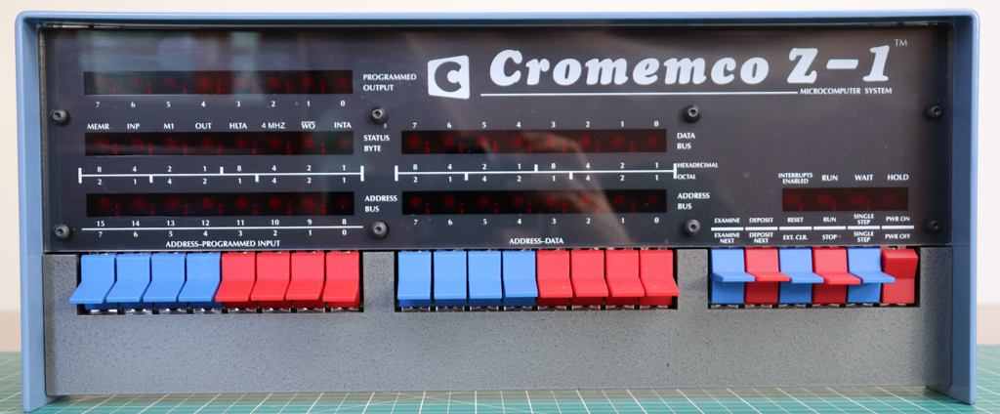

# Cromemco Z-1 replica

## Overview

[Cromemco](https://en.wikipedia.org/wiki/Cromemco) was a notably more successful microcomputer manufacturer them [IMSAI](https://en.wikipedia.org/wiki/IMS_Associates,_Inc.), despite the iconic status of the [IMSAI 8080](https://en.wikipedia.org/wiki/IMSAI_8080).

Initially producing add-on cards and peripherals for other S-100 computers, notably the [Cyclops Camera](https://en.wikipedia.org/wiki/Cromemco_Cyclops), [Dazzler](https://en.wikipedia.org/wiki/Cromemco_Dazzler) graphics interface and [D+7A](http://www.s100computers.com/Hardware%20Folder/Cromemco/D+7IO/D+7IO.htm) digital & analog I/O interface, Cromemco went on to produce a family of related microcomputers initially powered by the Zilog Z80 microprocessor and then later incorporating both the Z80 and the Motorola 680x0 series of microprocessors.

Their first complete microcomputer was the [Cromemco Z-1](https://deramp.com/downloads/mfe_archive/010-S100%20Computers%20and%20Boards/00-Cromemco/80-Cromemco%20Brochures%20and%20Literature/1976%20Cromemco%20Z1.pdf)

From its appearance you might think it is just a rebadged IMSAI 8080, but that is not the case (no pun intended).

Cromemco does seem to have OEM'ed the front panel, chassis & lid for the Z-1 from IMSAI but the internals were all produced by Cromemco, and at its heart was the Cromemco [ZPU](http://www.s100computers.com/Hardware%20Folder/Cromemco/Z80/ZPU.htm) CPU board powered by the Zilog Z80 microprocessor.

Although this computer could run CP/M, Cromemco produced their own CP/M (v1.33) like operating system, Cromemco DOS, [CDOS](https://en.wikipedia.org/wiki/Cromemco_DOS). 

Cromemco then followed their own path producing the Cromix operating system. A multitasking, multi-user, UNIX-like operating system running on the Z80 with banked memory. The last release of Cromix (version 11.27) for the Z80 was in 1984. Cromix continued to be developed but only for the 680x0 series of microprocessor based Cromemco computers.

What you see in the photo above is the Cromemco Z-1 replica kit produced by TheHighNibble. Identical to the [IMSAI 8080 replica](../imsai8080/) kit except for the text and logos on the front facia (see: the [Bill-of-Materials](#bill-of-materials).

Also powered by Udo Munk's [z80pack](http://bit.ly/Z80pack), specifically the **cromemcosim** machine, running on the [**ESP32**](https://www.espressif.com/en/products/hardware/development-boards) micro-controller targeting the ESP32-PICO-KIT.

## Features

The Cromemco Z-1 replica can run:

- CP/M
- Cromemco DOS (CDOS)
- Cromemco Cromix (up to version 11.27)

on a simulated Z80 microprocessor at 2 or 4 MHz (or "unlimited" at approximately 5MHz), with up to 8 banks of 64KB of RAM.

There is support for up to three (3) UARTs (physical or virtual), so Cromix is configured with three (3) TTY devices and can support up to three (3) simultaneous users since it is a multitasking, multi-user, UNIX-like operating system.

Like the IMSAI 8080 replica, the Cromemco Z-1 replica also comes with a web based desktop user interface that provides access to a range of virtual devices including:

- 3 simulated TTY terminals (VT100 &/or Cromemco 3102 Video Terminal compatible)
- 2 line printers, 80/132 column selectable
- 4 simulated 8" floppy disks
- Cromemco Dazzler graphics interface
- Cromemco D+7A I/O including JS-1 joystick emulation (from connects USB joystick)
- Paper tape punch/reader

## Availability

The Cromemco Z-1 replica is available to order as of April 2022.

::: danger Please note:
The hardware kit is available now, complete with the Cromemco Z-1 facia panel (see: the [Bill-of-Materials](#bill-of-materials).

However, the Cromemco Z-1 firmware is **not yet finalised** and is still in a closed Beta.

Kits that are shipped prior to the production Cromemco Z-1 firmware release will ship with an image of the [IMSAI 8080](../imsai8080/) replica firmware, and **NOT** the Cromemco Z-1 beta firmware.

Once the production Cromemco Z-1 firmware is released, the ESP32 can be reflashed (using [Over The Air](../imsai8080/update/#updating-the-firmware) updates) with the Cromemco Z-1 firmware.
:::

### Expression of interest

I am accepting expressions of interest via email. If you send email to [info@thehighnibble.com](mailto:info@thehighnibble.com) I will add you to the list.

Please specify that you are interested in the **Cromemco Z-1 replica**.

Once a kit is available for you within the month, I will contact you to confirm your order.

The price for the kit is USD$280 and in addition you also pay for postage and any PayPal transaction fees.

## News & Updates

You can stay up-to-date with news about additions to this site, or new YouTube videos demonstrating the features of the kits by following on [Twitter @TheHighNibble](https://twitter.com/@TheHighNibble) and subscribing to [TheHighNibble YouTube Channel](https://www.youtube.com/thehighnibble)

 
 

    
    

 

## Forum

The [IMSAI 8080esp forum](http://bit.ly/IMSAI8080esp) has been set up in Google Groups. It is open to everyone to read the posts but you must apply to join the group if you wish to post.

## Specifications

### Dimensions (built)

17 1/8" x 7" x 2 11/16"

435mm x 178mm x 68mm

(width x height x depth)

### Weight (built)

4.22 lbs

1.915 kg

### Power

5VDC @ 500 mA (max., < 100mA typical) - USB micro-B plug required

### Dimensions (boxed/shipped)

18 1/3" x 7 1/2" x 3"

465mm x 190mm x 75mm

(width x height x depth)

### Weight (boxed/shipped)

less than 5.1 lbs

less than 2.3 kg

## Bill-of-Materials

The Bill-of-Materials for the Cromemco Z-1 replica is the same as for the IMSAI8080 replica [Bill-of-Materials](../imsai8080/bom/)
with the exception of the front panel facia.

Here is a side-by-side image of the two facias so that you can see the differences.

::: tip
The difference in colour is just my bad photography and lighting: they are both matt black .
:::

::: warning Please Note
I will only supply one facia with the kit, so don't ask for both. 
:::

## [Recommended tools for assembly](../imsai8080/tools/)

## [Step-by-step assembly guide](../imsai8080/assembly/)

## Configuration

TBA

## Updating Software

Once the production Cromemco Z-1 firmware is released, the ESP32 can be reflashed (using [Over The Air](../imsai8080/update/#updating-the-firmware) updates) with the Cromemco Z-1 firmware.

Both the IMSAI 8080 replica and the Cromemco Z-1 replica will be able to run either firmware, and can be reflashed using the OTA method linked above.

## [Troubleshooting (draft)](../imsai8080/troubleshooting/)

## Enhancements and Add-ons

### Planned

- TBA
