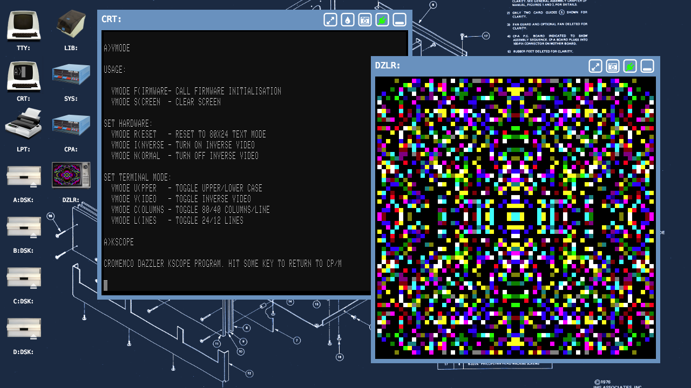
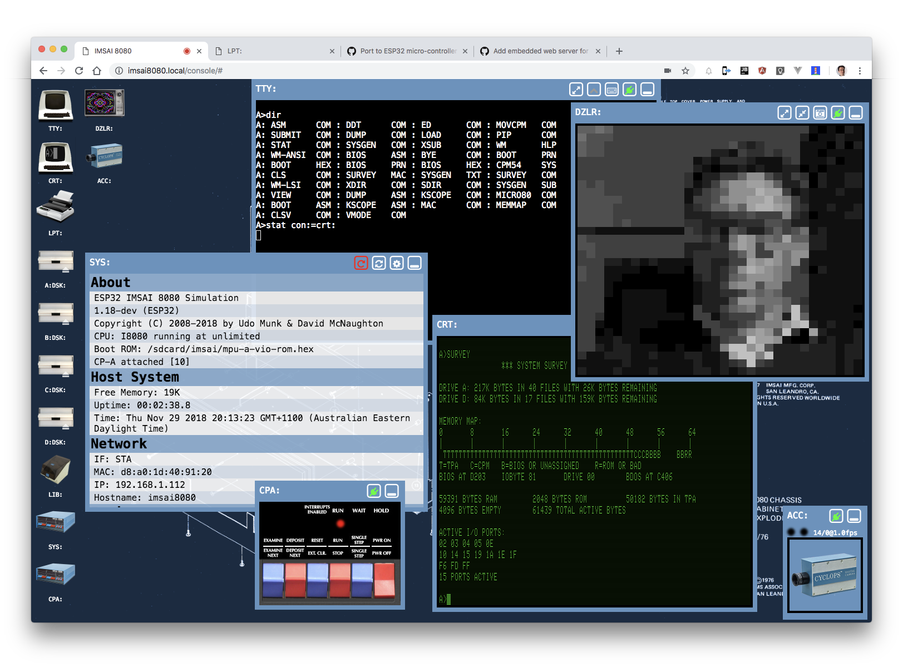

# IMSAI 8080 replica

## Overview

I began working on building an IMSAI 8080 CP-A Front Panel replica in May 2017.

I first ported Udo Munk's [z80pack](http://bit.ly/Z80pack) V1.36-dev, specifically the **imsaisim** machine, to the [**ESP32**](https://www.espressif.com/en/products/hardware/development-boards) micro-controller targeting the ESP32-PICO-KIT

These devices have a dual-core CPU @ 240MHz, 520KB SRAM, 4MB Flash RAM (storage) and builtin Wi-Fi, USB connector for serial UART and programming.

To this I added

- microSD Card for a FAT filesystem (using an 16GB card)
- PSRAM for banked memory implementation
- MAX232 style RS-232 driver and DE-9M sockets for serial UART
- Full size, fully functional replica of the IMSAI CP-A front panel with all LEDs and switches (for scale: the whole unit is 17" wide)

If you've seen the original IMSAI 8080, I hope you'll agree that the toggle switches are a great match to the original colours. The case is made of 3mm thick aluminium, powder coated blue and also a good match to the original.

Sometimes I use the USB based serial UART for TTY: (under CP/M) but most of the time I connect over Wi-Fi using a browser to launch the desktop GUI that this port of the **imsaisim** can serve using an embedded web server.

Running the replica at unlimited speed I can get a simulated clock speed somewhere above 5 MHz, there is certainly no problem with reliably running the simulation at a realistic 2 MHz or 4 MHz making WordStar, SuperCalc2, M80/L80 a pleasure to use.

## Features
The stock **imsaisim** machine from **z80pack** is configured with:

- 64K of RAM, however the CP/M 2.2 BIOS is configured for 56K to avoid conflicts with ROMS
- 4 simulated 8" floppy disks using 256K floppy image files (*.dsk)
- IMSAI MPU-A bootrom
- MPU-B style bank-switched ROM and RAM for bootrom masking
- IMSAI VIO support (optional based on bootrom choice)
- Harddisk emulation
- Virtual 'AT' modem over TCP/IP sockets (with selectable telnet protocol support) (outbound/dial and (auto) answer mode)
- An MMU with Banked memory management to enable CP/M 3.0 (Plus) with banked memory
- An RTC to support CP/M 3.0 (Plus)
- A range of disk images with different operating systems, applications, games, demos...

The best reference for the **imsaisim** machine is Udo Munk's [z80pack](http://bit.ly/z80pack) site.

To this I added a simulated GUI desktop that you access over Wi-Fi from an evergreen browser (Chrome & Firefox, but not Safari) that includes the following virtual/emulated devices (some that I just made up)

- **TTY:** - VT100/ansi compatible character mode serial terminal, can be windowed or zoomed to full-screen (over websockets)
- **CRT:** -  implementation of the IMSAI VIO (over websockets: mirrors the 2KB display RAM and does all rendering in the browser)
- **LPT:**  - implementation of an 80/132-column dot-matrix/line printer with selectable paper-types - ready to print on your real printer (dumb text printer, no Esc codes, over websockets)
- **X:DSK:**  & **LIB:** - graphical disk manager for the 4 floppy drives A-D, including eject, insert (drag-and-drop) from a disk library (.../machine/disks/library/), download disk image, upload disk image, delete disk image (uses RESTful web service interface). Also a hard disk presented as drive I.
- **CPA:** - IMSAI CP-A front panel (only the 6 control switches & 4 status LEDs on the RHS, over websockets)
- **SYS:** - system status window, shows details of the simulation (host?), enables remote reboot
- **CFG:** - configuration file editor, enables config files (.../machine/conf) to be edited and saved
- **PTR:** - virtual paper tape reader and punch
- **DZLR:** - implementation of the Cromemco Dazzler graphics display
- **ACC:** - implementation the Cromemco 88-CCC Cyclops Camera Controller and 88-ACC Cyclops camera (using the web camera attached to the machine running the browser)
- **JS1:** - implementation of the Cromemco D+7A I/O including JS-1 joystick emulation (from connected USB joystick)

You can see what they look like in these screen-shots.

When the browser is made full-screen you would't know you were in a browser, it just feels like a desktop GUI.

The desktop GUI has been back-ported to **z80pack V1.36-dev** for desktop operating systems (OSX/Windows/Linux) so you can experience it on a modern PC running the **imsaisim** machine simulation.

<!--  -->

### Notes

- TTY:, VIO:, DZLR: are all able to go **full-screen** with the use of a widget on the window title-bar and the use of the `ALT-Enter` (Win) or `CMD-Enter` (Mac) key combination
- you can take screen-shots of the VIO: and DZLR: with the use of a widget on the window title-bar
- ability to change aspect-ratio of the Dazzler display between 1:1 (square pixels), 4:3 (CRT TV), 8:7 (not common, but the closest to the "real thing" I could measure off a YouTube video of an original [Cromemco Dazzler working](http://bit.ly/2KVVcfHI), so I've made this the default), with the use of a widget on the window title-bar
- this chosen aspect-ratio is preserved in full-screen mode
- but not when a screen-capture is taken, this is always 512x512 square pixels

Here are some screen shots of the VIO: and DZLR: made with the  screen-shot feature.

The desktop GUI is developed to work with the latest version of the Google Chrome browser (Official Build). If it works with other browsers that's fortunate but not tested. Its currently looks to work with FireFox (not extensively tested), but I regularly have problems working with Safari.

## Availability

The first batches of IMSAI 8080 replicas shipped in June 2019.

Please be assured that I am continuing to make kits in 2022 and will continue to do so until I can no longer source the parts.

### Expression of interest

I accept expressions of interest via email. If you send email to [info@thehighnibble.com](mailto:info@thehighnibble.com) I will add you to the list.

Once a kit is available for you within the month, I will contact you to confirm your order.

The price for the kit is USD$280 and in addition you also pay for postage and any PayPal transaction fees.

## News & Updates

You can stay up-to-date with news about additions to this site, or new YouTube videos demonstrating the [features](/imsai8080/#features) listed above by following on [Twitter @TheHighNibble](https://twitter.com/@TheHighNibble) and subscribing to [TheHighNibble YouTube Channel](https://www.youtube.com/thehighnibble)

 
 

    
    

 

## Forum

[TheHighNibble forum](https://github.com/orgs/thehighnibble/discussions) has been set up on GitHub. The forum is public and readable by anyone but if you wish to post you need to become a member.

Membership requires you to have GitHub account. Email to [info@thehighnibble.com](mailto://info@thehighnibble.com) with your GitHub name and I will send you an invite to join the discussion forum.

## Specifications

### Dimensions (built)

17 1/8" x 7" x 2 11/16"

435mm x 178mm x 68mm

(width x height x depth)

### Weight (built)

4.22 lbs

1.915 kg

### Power

5VDC @ 500 mA (max., < 100mA typical) - USB micro-B plug required

### Dimensions (boxed/shipped)

18 1/3" x 7 1/2" x 3"

465mm x 190mm x 75mm

(width x height x depth)

### Weight (boxed/shipped)

less than 5.1 lbs

less than 2.3 kg

## [Bill-of-Materials](bom/)

## [Recommended tools for assembly](tools/)

## [Step-by-step assembly guide](assembly/)

## [Configuration (draft)](configure/)

## [Updating Software (draft)](update/)

## [Troubleshooting (draft)](troubleshooting/)

## Enhancements and Add-ons

### Planned

- Add a UI on the desktop GUI for the virtual 'AT' modem
- Add basic escape code support for formatting output on the LPT: line printer
- Hardware based VIO, Dazzler, VT100 terminal with VGA output and PS/2 (and maybe USB) keyboard input
- Hardware based interface for the replica Cromemco Cyclops ACC: digital camera
