# Bill of Materials (Draft)

::: tip
I haven't figured out how to set the image sizes in the site tool I am using, so image sizes my vary. To see them in full size you can always right-click on an image and `Open Image in New Tab`
:::

::: warning Notes on the PCB

- There is no resistor R15, it was removed from the design long ago and the resistors were never renumbered
- There were 2 silk screen errors on the PCB (v3.4.1, fixed on v3.4.2 and later):
    1. the LED LA14 is incorrectly labeled as LS14
    2. the LED LD0 is labeled on the left of the LED and should be labeled above as per LD1-LD7
- There is a 5x2 group of through-holes marked **Spare** that nothing gets soldered into
- There are two groups of 8x1 through-holes that are unmarked (one above LRN1 and one below RN1) that nothing gets soldered into
:::

## Through Hole (THT) components

| Part | Quantity | PCB | Description |
| ---- | --------:| --- | ----------- |
|  | 44 (45 packed) |  LO0-7, LS0-7, LA0-15, LD0-7, LIE1, LRN1, LWT1, LHT1 | <h4>LED Red 5mm</h4> LEDs have polarity, ie. they must be inserted the correct way around to function properly (see assembly guide). |
|  | 44 (45 packed) | R16-59 | <h4>Resistor 3K ohm [Orange, Black, Red, Gold]</h4> One for each LED. The value 3K ohm was selected because it gives a reasonable brightness to the LEDs. If you want super-bright you can go down to 220 ohm. If you want the LEDs to be more dim, you can always substitute a higher value for these resistors. |
|  | 14 (15 packed) | R1-12,14; R13 (back) | <h4>Resistor 10K ohm [Brown, Black, Orange, Gold]</h4> |
|  | 1 | RN1 (back) | <h4>Resistor Network 6x10K ohm</h4> Pin 1 is indicated on the component by a white dot and on the PCB by the square pad. |
|  | 17 (18 packed) | C1, 3-12, 17; C2, 13-16 (back) | <h4>Capacitor 100nF (0.1μF, 104)</h4> These are the only capacitors in the kit, so all the capacitors have the same value. Keeps it simple. |
| 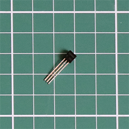 | 1 | Q1 (back) | <h4>S8050 NPN Transistor (TO-92-3) </h4> This component and its associated resistor R13 are optional. They allow the ESP32 to be flashed over USB without removing it from the connectors. They only do something if you add extra "bodge" wires to the ESP32 board and connect these to the Boot->DTR/RTS pins. |
|  | 6 | U1-6 | <h4>74HC595</h4> 8-bit serial in/out Shift Register 3-State Outputs|
|  | 4 | U7-10 | <h4>74HC165</h4> Shift Register 8-bit, parallel load|
| 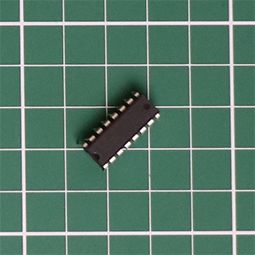 | 1 | U11 (back) | <h4>MAX3232</h4> Low-Power, up to 1Mbps, True RS-232 Transceivers Using Four 0.1μF External Capacitors (C13-16) |
|  | 11 | (U1-11) | <h4>16 pin DIP Socket</h4> One for each IC, U1-11|
|  | 2 | RS232-1,2 (back) | <h4>DE9 (DB9) Male Socket</h4> Currently only RSR232-1 can be used as SIO1, without hardware handshaking . Future work to enable SIO2 &/or hardware handshaking on SIO1. |
| 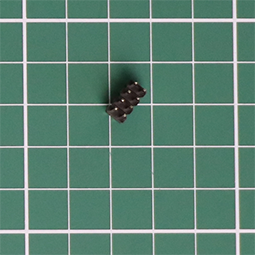 | 1 | Boot (back) | <h4>Header 4x2 Male</h4> Using the provided shunt-jumpers you can set low level boot options via this header (future, currently not active) |
|  | 2 | Patch, Comms (back) | <h4>Header 8x2 Male</h4> Using the provided shunt-jumpers you can configure the RS232 serials comms via these two headers |
|  | 2 | ESP32 (back) | <h4>Connector 20x1 Female</h4> These two connectors form a socket for mounting the ESP32-PICO-KIT board |
|  | 1 | | <h4>Header 20x1 Male</h4> This header is not soldered to the PCB. It is supplied for a few uses. 1) A pair of 3 pin headers, cut off and soldered to the unpopulated header pin holes on ESP32 (see assembly guide). 2) An 8 pin header, cut off and used if a uSD daughter card is required to replaced a damaged uSD Card Socket. The remaining pins are spare. |
|  | 1 | Reset | <h4>Tactile Switch SPST-NO</h4> This reset switch is redundant as the ESP32 has its own reset press-button switch, but I like to have it. It allows the device to be reset by pushing a pencil/pen tip through an air vent hole in the side of the lid, rather than having to look around the back to find the tiny switch on the ESP32 |

## Surface Mount Device (SMD) components

::: tip Don't Panic

- Yes there are two SMD components!
- You can do it!
- You can do it with a regular soldering iron, but you are going to need flux (see assembly guide and tools)
:::

| Part | Quantity | PCB | Description |
| ---- | --------:| --- | ----------- |
|  | 1 | U13 | <h4>PSRAM 64Mb (8M x 8) SPI/ QPI SOP-8_150mil</h4> |
|  | 1 | uSD Card | <h4>microSD Card Socket</h4> |

## Rocker Switches

| Part | Quantity | PCB | Description |
| ---- | --------:| --- | ----------- |
|  | 1 | S1 | <h4>Red Power Switch (On-On)</h4> |
|  | 3 | S2, S4, S6 | <h4>Blue Rocker (Mom-off-Mom)</h4> |
|  | 2 | S3, S5 | <h4>Red Rocker (Mom-off-Mom)</h4> |
| 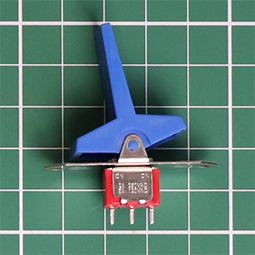 | 8 | SA4-7, SA12-15 | <h4>Blue Rocker (On-On)</h4> |
|  | 8 | SA0-3, SA8-11 | <h4>Red Rocker (On-On)</h4> |

## Miscellaneous components

| Part | Quantity | PCB | Description |
| ---- | --------:| --- | ----------- |
| 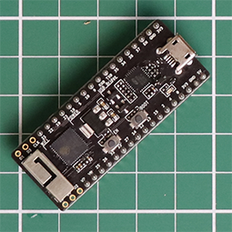 | 1 | ESP32 (back) | <h4>ESP32-PICO-KIT v4.1</h4> Look closely and you will see that 3 of the pinout through-holes on each side are unpopulated (at the end where the antenna is, opposite end to the micro-USB connector). These need to be populated with 0.1" pitch male header pins (provided in the strip of 20 above). These enable the PSRAM, soldered on the PCB, to be accessed by the ESP32. |
|  | 1 | | <h4>microSD 16GB Memory Card</h4> |
|  | 8 | | <h4>Shunt-Jumper</h4> |
|  | 1 | | <h4>Test lead</h4> Used to test LEDs during assembly, but not used in the final assembled kit |
| 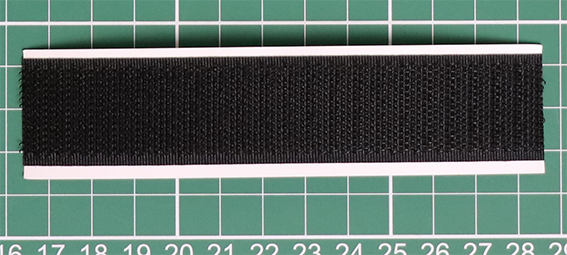  | 120mm x 25mm | | <h4>Black Velcro adhesive backed hook & loop tape</h4> Used to mount the Charcoal grey hammer tone painted acrylic switch surround to the Black acrylic LED/switch masking plate.
| | 1 | | <h4>PCB</h4> |

## Mounting hardware

| Part | Quantity | PCB | Description |
| ---- | --------:| --- | ----------- |
| 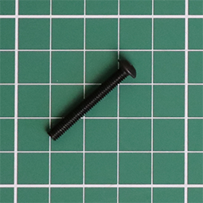 | 8 | | <h4>M4x30mm Hex Socket Screw</h4> |
|  | 8 | | <h4>Spacer 8mm Nylon</h4>  The 8mm spacers fit on the `M4x30mm Hex Socket Screws` **in front of** the PCB, between the PCB and the `3mm Black acrylic LED/switch masking plate` |
| 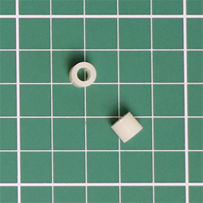 | 8 | | <h4>Spacer 6mm Nylon</h4> The 6mm spacers fit on the `M4x30mm Hex Socket Screws` **behind** the PCB, between the PCB and the `3mm Clear acrylic back cover` |
| 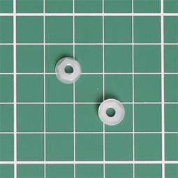 | 8 | | <h4>M4 Hex Nut Nylon</h4> |
|  | 4 | | <h4>M3x12mm Black Machine Screw</h4> |
|  | 4 | | <h4>M3 Nut</h4> |

## Acrylic parts

::: tip
Most pieces of acrylic have a protective backing cover (plastic or paper) to protect them from scratching during cutting and transportation. This should be removed before you use them in the assembly of the kit.

If any of the following acrylic parts, especially the clear parts, appear white or any colour other than indicated, it is because they have a protective covering.
:::

| Part | Quantity | Description |
| ---- | --------:| ----------- |
|  | 1 | <h4>6mm Clear acrylic front cover</h4> |
|  | 1 | <h4>6mm Charcoal grey hammer tone painted acrylic switch surround</h4> |
|  | 1 | <h3>NEW</h3><h4> 3.0mm White text/decals on Black facia over a transparent red filter</h4> |
|  | 1 | <h4>3mm Black acrylic LED/switch masking plate</h4> |
| 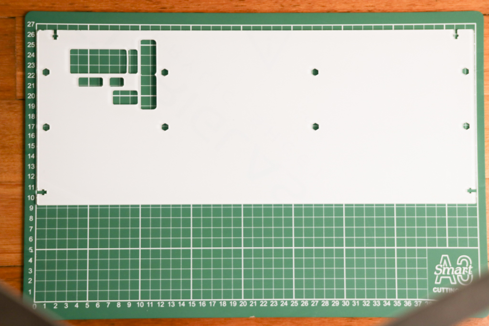 | 1 | <h4>3mm Clear acrylic back cover</h4> |
|  | 1 | <h3>NEW</h3><h4> 3mm Blue aluminium lid</h4> |
| 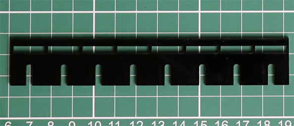 | 1 | <h4>3mm Black acrylic LED spacer & switch alignment guide (8 slots)</h4> |
| 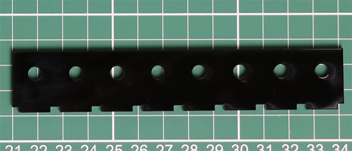 | 1 | <h4>3mm Black acrylic LED alignment guide (8 round holes)</h4> |
