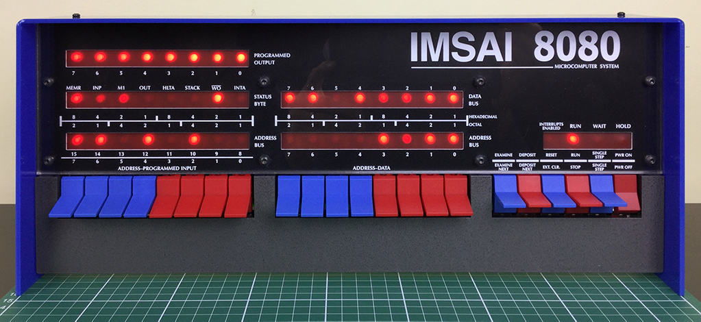
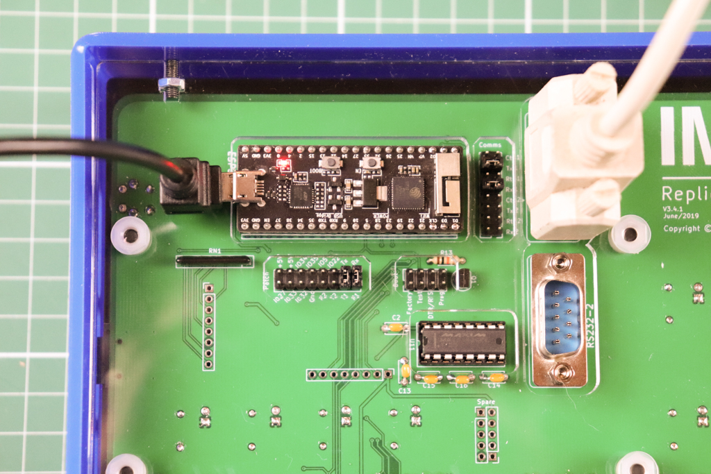

# Configuration (Draft)

## Overview

::: warning
Just like the real IMSAI 8080 computer, the default configuration of your kit is an empty machine. While you *can* enter instructions using the toggle switches (and you *should* experiment with this sometime) it's more interesting to run some real software.
The default configuration is like an empty machine with no ROM only RAM.
:::

In order to run any applications, you will need to activate a virtual ROM (eg. to run BASIC, or boot a floppy disk) and maybe load an operating system (such as CP/M) from a virtual disk.

Also like the original computer, your IMSAI 8080esp has no video output port. Owners of the original IMSAI 8080 would connect a serial terminal (either a teletype printer or visual display unit) to a serial port. While you can still do this (see [Serial Communications](http://localhost:8080/imsai8080/configure/#serial-communications-rs232-usb) section), this modern kit offers a much easier solution using Wi-Fi.

Once power is applied to your kit, the ESP32 will create a Wi-Fi Access Point. You can connect your computer to this Wi-Fi network as if it were connected to a Wi-FI router. You can then open a web page, the Desktop UI, that will give you full access to the IMSAI 8080esp - including a virtual serial terminal (TTY:), floppy disks, printer (LPT:) and more.

Once connected, you can then configure the IMSAI 8080esp to connect directly to your home Wi-Fi, so you can use it without having to change your Wi-FI settings again.

## Getting connected

* Plug in the power to the IMSAI 8080esp kit.
* On your computer, open the Wi-Fi settings and select the `imsai8080` network (SSID).
* When prompted for a password, enter `password`.

Your computer should now be connected, and you will be able to open the Desktop UI. The web interface has been written and tested with the Chrome browser in mind, and you might find it works differently if you are using a different browser.

* If you have a Mac, open your browser and enter `imsai8080.local` as the web address.
* If you have a PC, open your browser and enter `192.168.4.1` as the address.

## Default configuration

### IMSAI 8080 (guest)

::: warning
The default configuration is like an empty machine with no ROM only RAM.
:::

* RAM is 64K occupying the entire address space from `0000h` to `FFFFh`
* CPU is Intel 8080 @ 2MHz with support for undocumented op-codes
* No boot ROM is active by default

### ESP32 (host)

* Wi-Fi set to **Access-Point (AP)** mode with the default SSID of `imsai8080`, password of `password`
* Hostname (HOSTNAME environment variable) set to `imsai8080` (`imsai8080.local` for mDNS)
* Port (PORT environment variable) set to `80`
* Timezone (TZ environment variable) set for AEST+10, ADST+11 (ie. Sydney, Australia)
* Time server (NTP_SERVER environment variable) set to `pool.ntp.org`
* POST (Power On Self Test) disabled
* Console log level set to `NONE` (details to follow)

::: tip
Once you are connected to the Wi-Fi network, start a Chrome browser and enter the URL `http://imsai8080.local` to see the Desktop UI.
:::

## Startup configuration (Non-Volatile Storage, NVS)

The startup configuration is modified via the toggle switches on the front panel.

To enter *startup configuration mode*, follow the sequence:

1. ensure the ESP32 is connected to a USB power source, the red LED on the ESP32 board should be illuminated
2. turn the front panel power switch **off**, `PWR OFF`, the down position
3. hold the `EXAMINE` toggle in the **Examine**, up position
4. press and release the `Reset` switch while holding the `EXAMINE` toggle up
5. hold the `EXAMINE` toggle for a second or two
6. release the `EXAMINE` toggle

::: tip
There are 2 `Reset` switches available that both do the same thing:

* The `Tactile Switch SPST-NO` you installed in the `Reset` position on the PCB
* The small tactile switch on the ESP32 board marked `EN`
* **NOT** the *blue toggle switch* on the front panel
:::

The IMSAI 8080esp should now be in *startup configuration mode*. This is indicted by a running LED pattern (right to left) on the 4 LEDS at the right hand side of the front panel (`HOLD`, `WAIT`, `RUN`, `INTERRUPTS ENABLED`).

::: tip
The current *startup configuration value* is displayed on the Address Bus LEDs (bits 0-15) when you enter *startup configuration mode*.
:::

::: tip
The whole procedure, including entering a value to boot into CP/M 2.2 (see below) is demonstrated in this *Kit Assembly* video
<!--  -->
<iframe width="560" height="315" src="https://www.youtube.com/embed/Cwv_gRtWnZM?start=200" frameborder="0" allow="accelerometer; autoplay; encrypted-media; gyroscope; picture-in-picture" allowfullscreen></iframe>
:::

::: warning
When you **Deposit** a new *startup configuration value*, all the bits of the current value are overwritten. If your objective is to **modify** the existing value changing only a few of the bits, you must toggle in all the bits of the existing value indicated by the Address Bus LEDs and then switch the bits you want to configure differently, before you **Deposit** this new value.
:::

::: tip Booting into MSBASIC 1.4 (8K)
To configure the IMSAI 8080esp to boot directly into a ROM based *MSBASIC 1.4 (8K)* in 8080 mode @ 2 MHz, the following startup configuration value can be used.

* Binary: 0000 0100 0000 0000
* Octal: 002000
* Hexadecimal: 0400

1. Enter *startup configuration mode* (above)
2. Toggle in this value on the **Address** toggle switches
3. Raise the `DEPOSIT` toggle to the **Deposit**, up position to store the entered startup configuration value.
4. Reboot the IMSAI 8080esp by pressing a `Reset` switch
:::

::: tip Booting into XYBASIC
To configure the IMSAI 8080esp to boot directly into a ROM based *XYBASIC* in Z80 mode @ 4 MHz, the following startup configuration value can be used.

* Binary: 0000 0101 0101 0000
* Octal: 002520
* Hexadecimal: 0550

1. Enter *startup configuration mode* (above)
2. Toggle in this value on the **Address** toggle switches
3. Raise the `DEPOSIT` toggle to the **Deposit**, up position to store the entered startup configuration value.
4. Reboot the IMSAI 8080esp by pressing a `Reset` switch
:::

::: tip Booting into CP/M 2.2

To configure the IMSAI 8080esp to boot from the disk image in drive `DSK:A:` in Z80 mode @ 4 MHz, the following startup configuration value can be used. You can mount the `cpm_22.dsk` disk image in drive `DSK:A:` via the *Desktop UI*.

* Binary: 0000 1001 0101 0000
* Octal: 004520
* Hexadecimal: 0950

1. Enter *startup configuration mode* (above)
2. Toggle in this value on the **Address** toggle switches
3. Raise the `DEPOSIT` toggle to the **Deposit**, up position to store the entered startup configuration value.
4. Reboot the IMSAI 8080esp by pressing a `Reset` switch
:::

| Address Bit | Name | Equivalent Flag | Description |
| ----------: | ---- | --------------- | ----------- |
| 0 | NVS_POST | n/a | Enable Power On Self Test (POST) |
| 1-2 | NVS_LOG_LEVEL | n/a | Set ESP32 console **Log Level**, 0 = NONE; 1 = ERROR; 2 = WARN; 3 = INFO |
| 3 | NVS_IF_STA | n/a | Set Wi-Fi Mode,  0 = Access Point Mode (AP); 1 = Station Mode (STA) |
| 4 | NVS_Z80 | `-z`, `-8` | Enable Z80 CPU emulation, 0 = 8080 `-8`; 1 = Z80 `-z` |
| 5 | NVS_NO_UNDOC | `-u` | Suppress support for undocumented op. codes, 1 = `-u` |
| 6 | NVS_4MHZ | `-f` | Set CPU speed, 0 = 2 MHz `-f 2`; 1 = 4 MHz `-f 4` |
| 7 | NVS_UNLIMITED | `-f 0` | Set CPU speed to Unlimited, 0 = use speed from bit 6; 1 = Unlimited `-f 0` |
| 8-10 | NVS_BOOT_ROM | `-x` | Set boot ROM to 1 of 7 *slots*, 0 = No boot ROM, 1-7 = use slot *n* `-x $ROMn` |
| 11 | NVS_BANK_ROM | `-r` | Enable **MPU-B(A)** style Banked ROM/RAM functionality, 1 = `-r`. Only compatible with MPU-A ROM images. |
| 12-15 | | | Reserved for future use |

To set the startup configuration mode value, follow the sequence:

1. To **set** a bit, put the corresponding **Address** toggle switch in the **up** position.
2. To **clear** a bit, put the corresponding **Address** toggle switch in the **down** position.
3. Raise the `DEPOSIT` toggle to the **Deposit**, up position to store the entered startup configuration value.

::: warning
The IMSAI 8080esp must be rebooted for the new configuration to take effect. This can be done by pressing a `Reset` switch.
:::

::: tip
For further details about the *Equivalent Flag* refer to the **Z80PACK** documentation for the **imsaisim** machine.
:::

## Serial Communications (RS232, USB)

The **IMSAI 8080esp** is configured with a single simulated **SIO** UART (TTY:). When the machine boots, the **SIO** UART is routed to the physical UART on the `ESP32-PICO-KIT`.

This enables you to use any software on the IMSAI 8080 that communicates via the SIO (TTY:) using a terminal or terminal emulator depending your method of connection.

The only supported speed with the current firmware is 115200 baud @ 8N1

::: tip
Both the *ESP32 console log* and the IMSAI 8080 **SIO** (TTY:) will be directed to the serial UART. If you set the `NVS_LOG_LEVEL` to `INFO` (3) this will likely send console log messages during normal use of the machine. It is recommended to set the `NVS_LOG_LEVEL` to a lower level during normal operation.
:::

::: warning
If you start the **Desktop UI** from a web browser and the *TTY: virtual device* is connected (default behavior) then the simulated SIO UART (TTY:) is disconnected from the physical UART on the `ESP32-PICO-KIT` and instead re-routed to the *TTY: virtual device* on the Desktop UI. If the *TTY: virtual device* is disconnected, then the SIO UART is re-routed back to the physical UART on the `ESP32-PICO-KIT`, ie. only one of these two destinations can be connected at a time.

**Note: the *ESP32 console log* is always sent to the physical UART and is never redirected.**
:::

### Serial UART over USB

The `ESP32-PICO-KIT` supports serial communications from the UART over USB. It uses a *Silicon Labs CP210x USB to UART bridge*

1. connect the `ESPP32-PICO-KIT` to a PC using a suitable USB cable
2. start a terminal emulator on the PC set for 115200 baud 8N1 connected to the serial device your OS identifies the `ESP32-PICO-KIT` on
   * Windows will be a COMx: port
   * OSX will be /dev/tty.SLAB_USBtoUART
   * Linux will be /dev/ttyUSB0 (or similar, TBA)

::: tip
If you do not see a TTY/COM port on your PC presented by the ESP32-PICO-KIT when connected, you may need to install a driver for the *Silicon Labs CP210x USB to UART bridge*.

Drivers are available direct from the manufacturer at [https://www.silabs.com/products/development-tools/software/usb-to-uart-bridge-vcp-drivers](https://www.silabs.com/products/development-tools/software/usb-to-uart-bridge-vcp-drivers)
:::

Additional information is available from the Espressif (manufacturer of the `ESP32-PICO-KIT`) web site at [https://docs.espressif.com/projects/esp-idf/en/latest/get-started/establish-serial-connection.html](https://docs.espressif.com/projects/esp-idf/en/latest/get-started/establish-serial-connection.html)

### Serial UART over RS232

*Serial UART over RS232* and *Serial UART over USB* are mutually exclusive, ie. they cannot be used at the same time.

*Serial UART over RS232* is configured by using the supplied jumpers/shunts to bridge the required pins on the `Patch` and `Comms` headers accessible on the rear of the PCB, and connecting a suitable RS232 device to the DE-9M connector labeled `RS232-1`

RS232 line levels are provided by the Maxim MAX3232 IC (data sheet TBA)

You must position 4 of the jumpers/shunts provided to enable the *Serial UART over RS232*. This image shows the only currently valid and supported configuration for the jumpers/shunts on both the `Patch` and `Comms` headers.



#### Patch header

* bridge Tx - T1 - *position second from right*
* bridge Rx - R1 - *right most position*

#### Comms header

* bridge @ Tx1 - *second position from top*
* bridge @ Rx1 - *fourth position from top*

::: warning
The DE-9M connector labeled `RS232-2`is currently unused but is intended for future expansion
:::

## Wi-Fi Communications

The ESP32 has on-board Wi-Fi and can boot in either **Access Point** (AP) or **Station** (STA) mode. The mode is determined by the **NVS_IF_STA** bit in the *startup configuration* stored in NVS and described [above](#startup-configuration-non-volatile-storage-nvs).

* In AP mode, the ESP32 acts as an Access Point and broadcasts a system defined SSID and provides DHCP services for clients to connect
  * The **SSID** hardcoded in the firmware is *imsai* with a **password** of *password*, this will only be used if the **boot.conf** file on the microSD card cannot be read or does not include a `HOSTNAME=name` statement, see [Boot.conf file](#boot-conf-file) below.
  * If a `HOSTNAME=name` statement is found in the **boot.conf** file, then this hostname is also used as the **SSID** in AP mode. In this case, the **password** still remains *password*
* In STA mode, the ESP32 acts as a Wi-Fi station or client and can join an existing Wi-Fi network (supporting WPA or WPA2, but not Enterprise WPA).
  * The **SSID** and **password** of the desired Wi-Fi network must be configured in the **boot.conf** file using the `SSID=name` and `PASSWORD=password` statements, see [Boot.conf file](#boot-conf-file) below.

::: tip
The **boot.conf** file can be edited via the **SYS:** virtual system device in the Desktop UI while connected to the IMSAI 8080esp running in AP mode.
Alternatively the **microSD Card** can be mounted in a PC and the `/imsai/conf/boot.conf` file edited directly in a text editor then the **microSD Card** returned to the IMSAI 8080esp before it is powered on.
:::

::: warning
When the IMSAI 8080esp is configured to work in station mode (STA) but it is unable to make a connection to the configured Wi-Fi network within 30 seconds, the ESP32 will reboot and temporarily start in AP mode.

* This enables you to connect to the IMSAI 8080esp from a browser on the advertised SSID and modify/correct the STA mode Wi-Fi configuration.
* The simplest way to determine if this has happed is to look for the AP mode SSID being broadcast, or to look at the ESP32 console log output on the UART.
:::

::: danger
The design of the IMSAI 8080esp is intended for only **one** Wi-Fi client (browser)to be connected at any given time. It is untested and not recommended to connect multiple clients at the same time.
:::

## Boot.conf file

The **boot.conf** file is located on the microSD card with the path `/imsai/conf/boot.conf`
As the ESP32 boots this file is loaded, each line parsed and the **variable=value** pair is added to the environment (like posix environment variables).

::: danger
There is little to no error checking done at the moment. If you significantly change this file and remove a variable, or leave a value blank you may cause the boot process to fail. I know I've managed to do that once or twice.

The solution is to mount the microSD card on a PC and edit the **boot.conf** file to fix the problem.
:::

The default configuration, as shipped is a follows:

```conf
#Network configuration
NTP_SERVER=pool.ntp.org
TZ=AEST-10AEDT,M10.1.0,M4.1.0
HOSTNAME=imsai8080
PORT=80
SSID=mySSID
PASSWORD=myPASSWORD
#Bootrom configutation
ROM1=mpu-a-rom.hex
ROM2=mpu-a-vio-rom.hex
ROM3=basic4k.hex
ROM4=basic8k.hex
ROM5=xybasic.hex
```

The *Network configuration* entries should be familiar and mostly self explanatory.

::: tip
The TZ variable cannot use values like *Sydney/Australia* (Olson format) but must use explicitly defined timezone strings (POSIX format) eg. `TZ=AEST-10AEDT,M10.1.0,M4.1.0` which is correct for Sydney, Australia.

A file with TZ variable values for many timezones can be found at [https://www.di-mgt.com.au/src/wclocktz.ini](https://www.di-mgt.com.au/src/wclocktz.ini) 
[Credit to: John Mann in the Forum](https://groups.google.com/d/msg/imsai8080esp/PdNyxAOeBhU/7_IgKXXbCAAJ)

An article that defines the POSIX format can be found at [Specifying the Time Zone with TZ](https://www.gnu.org/software/libc/manual/html_node/TZ-Variable.html), however please note, the "third format" referenced in this article is the Olson format, and not supported on the ESP32.
:::

The *Bootrom configuration* entries define the *slots* corresponding to the **NVS_BOOT_ROM** bits in the *Startup configuration (NVS)* (see above). There can be a maximum of 7, `ROM1` to `ROM7`. Each value should be the filename of a bootable program in *Intel HEX file format* (TBA) and located on the microSD card in the path `/imsai/`

## System.conf file

The **system.conf** file is located on the microSD card with the path `/imsai/conf/system.conf`

This is a legacy configuration file, maintained for source code compatibility with the *Z80PACK, imsaisim* machine.

The only parameter that effects the IMSAI 8080esp is the last line:

```config
ram            64
```

This still sets the maximum amount of RAM allocated to the simulated machine in KB.

:::danger
Changing this value is not tested and is likely to result in the machine failing to work as expected.
:::
