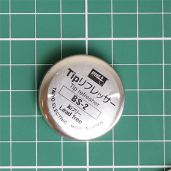

# Tools (Draft)

::: tip
I haven't figured out how to set the image sizes in the site tool I am using, so image sizes my vary. To see them in full size you can always right-click on an image and `Open Image in New Tab`
:::

::: warning
I use solder that contains lead because it has a lower melting temperature and is easier to work with. When soldering it is recommended that you work in a well ventilated area and use a fan to blow or suck the soldering fumes away from your face so that you don't breath them.
:::

## Soldering tools & supplies

| Tool | Description |
| ---- | ----------- |
|   | <h4>Soldering Iron</h4> I use this sub AUD$20 hobby soldering iron. It doesn't have a temperature control. The little red button gives a short term, fast temperature boot but I almost never use it. This iron has a 1mm Conical tip which is necessary for the two SMD components. A chisel tip can make the through-hole component soldering easier, but isn't necessary. |
|   | <h4>Solder</h4> You should use a flux/rosin core solder that release flux onto the solder joint as it melts. |
|   | <h4>Soldering Tip Clearer</h4> You should use a solder tip cleaner from time to time to keep the tip of your soldering iron in the best possible condition. This makes soldering much easier. |
|   | <h4>Solder Wick</h4> Solder Wick is the simplest tool to use to remove excess solder. I would say it is essential for attempting the SMD components, to remove any solder bridges that will almost always form. |
|   | <h4>Flux - in a Flux Pen</h4> Extra flux is essential for attempting the SMD components. It helps the solder flow exactly and only where you need it. The flux in rosin core solder isn't enough by itself. A flux pen is the simplest and easiest dispenser for small flux jobs. You can use flux gel, but its more messy to dispense and to clean up.|

## Clean-up supplies

| Tool | Description |
| ---- | ----------- |
|   | <h4>Isopropyl Alcohol (IPA)</h4> IPA in a handy spray pack is very useful for cleaning the PCB after soldering. It is recommended that any residual flux is removed, as with time it can corrode the solder joints (?). I'm not very careful about this, but if I have used extra flux then I usually remember to clean up afterwards. |
|   | <h4>Conductive Brush</h4> I bought a conductive brush to help with cleaning up using IPA because it looks cool. Watch any of Jan Beta's YouTube videos that involve soldering and he's very liberal with the IPA and the conductive brush. I guess you shouldn't use a toothbrush because it might generate static electricity (?). |
|   | <h4>Cotton Buds</h4> Very useful for wiping away and scrubbing off dried flux with some IPA. |

## Tools

| Tool | Description |
| ---- | ----------- |
|   | <h4>Side Cutters</h4> I recommend these *flat* side cutters over the more rounded one I used to have. They are easier to handle and get level with where you want to cut. |
|   | <h4>Self-closing Tweezers</h4> Regular tweezers are better than nothing, but these are easier to use as they don't spring open at the wrong time. |
|   | <h4>2.5mm Hex Driver</h4> A simple 2.5mm Metric Hex/Allen Key will do the job. This is only used to do up the **8 x M4 Hex Button Socket Screws** that hold the front panel together. |
|   | <h4>Phillips Head Screwdriver</h4> A medium to small Phillips Head screwdriver is required to tighten the **4 x M3 Black Machine Screws** that fix the lid to the front panel. |
|   | <h4>Digital Multimeter</h4> Not essential, but a useful tool to check for continuity and shorts as you solder the components to the PCB. |

## Miscellaneous

| Tool | Description |
| ---- | ----------- |
|  | <h4>Masking Tape</h4> Specifically, masking tape, not sticky tape. Masking tape is less likely to leave a sticky residue. This blue painters tape is usually better than the plain, paper based tape. You'll need a little of this to secure components in place while you solder them (see assembly guide). |
|  | <h4>Elastic Bands</h4> You might need 2 strong elastic bands to hold the **alignment guide for the rocker switches** in place when soldering in the rocker switches.
