# S-132 Bill of Materials (Draft)

::: tip
To see the images in full size you can right-click on an image and `Open Image in New Tab`
:::

::: warning Notes on the PCB
- PCBs are production (V1.5.1)
- Part identifiers are correct and there are no known errors
:::

## Main S-132 PCB (green)

### Surface Mount Device (SMD) components

::: tip Don't Panic

- Yes there are four SMD components!
- You can do it!
- You can do it with a regular soldering iron, but you are going to need flux
:::

| Part | Quantity | PCB | Description |
| ---- | --------:| --- | ----------- |
|  | 1 | ESP32-WROVER U1 | <h4>ESP-32 WROVER Module</h4> |
|  | 1 | NCP1117-33 U2 | <h4>NCP1117-33 LDO Linear Regulator</h4> |
|  | 1 | 74CBTLV3257 U3 | <h4>74CBTLV3257 SOIC-16 Quad 1-of-2 Multiplexer/Demultiplexer</h4> |
|  | 1 | 74HC00 U4 | <h4>74HC00 SOIC-14 Quad NAND Gate</h4> |

### Through Hole (THT) components

| Part | Quantity | PCB | Description |
| ---- | --------:| --- | ----------- |
|  | 2 |  R1, R2 | <h4>120 Ohm Resistor [Brown, Red, Black, Black, Brown]</h4> Only required if using the PS/2 keyboard |
| 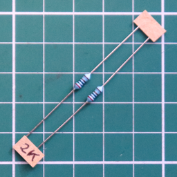 | 2 |  R3, R4 | <h4>2K Ohm Resistor [Red, Black, Black, Brown, Brown]</h4> Only required if using the PS/2 keyboard |
|  | 1 |  R5, R13 | <h4>10K Ohm Resistor [Brown, Black, Black, Red, Brown]</h4> |
|  | 3 |  R6, R8, R10 | <h4>806 Ohm Resistor [Grey, Black, Blue, Black, Brown]</h4> |
| 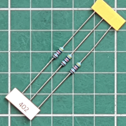 | 3 |  R7, R9, R11 | <h4>402 Ohm Resistor [Yellow, Black, Red, Black, Brown.]</h4> |
|  | 1 |  R12 | <h4>4.7K Ohm Resistor [Yellow, Violet, Black, Brown, Brown]</h4> |
| 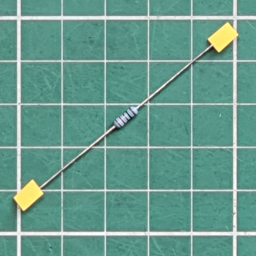 | 1 |  R14 | <h4>121 Ohm Resistor [Brown, Red, Brown, Black, Brown]</h4> |
| 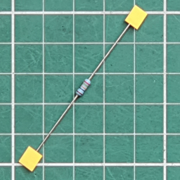 | 1 |  R15 | <h4>243 Ohm Resistor [Red, Yellow, Orange, Black, Brown]</h4> |
|  | 1 |  R16 | <h4>487 Ohm Resistor [Yellow, Gray, Violet, Black, Brown]</h4> |
| 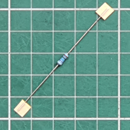 | 1 |  R17 | <h4>976 Ohm Resistor [White, Violet, Blue, Black, Brown.]</h4> |
|  | 4 |  D1, D2, D3, D4 | <h4>1N4148 Signal Diode</h4> Diodes have polarity, ie. they must be inserted the correct way around to function properly. |
| 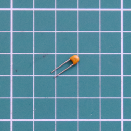 | 1 |  C2 | <h4>1 uF MLC (105) Capacitor</h4> |
|  | 7 |  C1, C6, C7, C8, C9, C10, C11 | <h4>100 nF (104) MLC Capacitor</h4> |
|  | 2 |  C3, C12 | <h4>100 uF Electrolytic Capacitor</h4> Electrolytic capacitors have polarity, ie. they must be inserted the correct way around to function properly. +VE to the Square Pad|
| 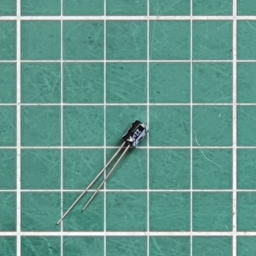 | 1 |  C4 | <h4>22 uF Electrolytic Capacitor</h4> Electrolytic capacitors have polarity, ie. they must be inserted the correct way around to function properly. +VE to the Square Pad|
| 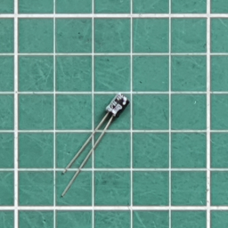 | 2 |  C5, C13 | <h4>10 uF Electrolytic Capacitor</h4> Electrolytic capacitors have polarity, ie. they must be inserted the correct way around to function properly. +VE to the Square Pad|
|  | 1 |  Q1 | <h4>S8050 NPN Transistor TO-92</h4> |
|  | 2 |  Prog, Reset | <h4>Tactile Push Button Switch SPST</h4> |
|  | 1 |  Bell | <h4>Buzzer 12.2mm dia.</h4> The Buzzer is polarized, ie. it must be inserted the correct way around to function. +VE to the Square Pad |
| 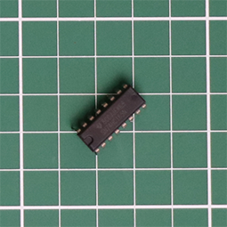 | 1 | U5 | <h4>74HC165</h4> Shift Register 8-bit, parallel load |
|  | 1 | U6 | <h4>MCP3008</h4> 8 Channel 10-bit Analog-to-Digital Converter (ADC)|
| 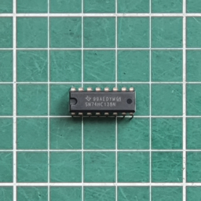 | 1 | U7 | <h4>74HC138</h4> 3-to-8 line Decoder/Demultiplexer, inverting |
|  | 1 | U8 | <h4>74HC595</h4> 8-bit serial in/out Shift Register 3-State Outputs |
| 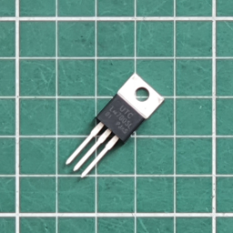 | 1 | LM7805 U9 | <h4>LM7805 +5V DC Linear Regulator</h4> |

### Through Hole (THT) headers

| Part | Quantity | PCB | Description |
| ---- | --------:| --- | ----------- |
|  | 1 |  JP1 5V Pwr | <h4>2 Pin Header - Horizontal</h4> |
| 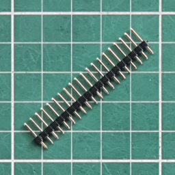 | 1 |  FTDI Program | <h4>6 Pin Header - Vertical</h4>Cut from 20 Pin male header |
|  | 1 |  Keyboard | <h4>6 Pin Header - Vertical</h4> Cut from 20 Pin male header. Only required if using the USB-HID keyboard |
|  | 1 |  Patch | <h4>8 Pin Header (4x2)- Vertical</h4> See notes for use of this header |
|  | 1 |  S-132 | <h4>16 Pin Header (8x2)- Female, Vertical</h4> Fit to the **underside** of the PCB - attaches to the IMSAI8080/Cromemco Z-1 |
|  | 1 |  KB Reset | <h4>2 Pin Header - Vertical</h4> Cut from 20 Pin male header. Only required if using the USB-HID keyboard |
|  | 4 |  For JP1 & Patch as required | <h4>Header Pin Shunts</h4> |
|  | 1 | D+7AIO | <h4>Connector 20x2 Female</h4> Sits between the DIP-16 IC sockets. This connector forms a 40-pin socket for the D+7AIO |

### Through Hole (THT) connectors

| Part | Quantity | PCB | Description |
| ---- | --------:| --- | ----------- |
|  | 1 |  VGA | <h4>DB15 VGA Female Socket - Right Angled</h4> |
|  | 1 |  PS/2 | <h4>Mini-DIN-6 PS/2 Keyboard Female Socket - Right Angled</h4>  Only required if using the PS/2 keyboard |
|  | 1 |  Power | <h4>6.2mm DC Barrel Jack Connector</h4> |
|  | 4 | (U4, U6, U7, U8) | <h4>16 pin DIP Socket</h4> One for each IC - U4, U6, U7, U8 |

### Printed Circuit Board (PCB)

| Part | Quantity | Description |
| ---- | --------:| ----------- |
|  | 1 | <h4>USB-HID Keyboard Interface</h4>If ordered |
|  | 1 | <h4>Front view</h4> |

## Mounting hardware

| Part | Quantity | Description |
| ---- | --------:| ----------- |
|  | 1 | <h4>M4x10mm Hex Socket Screw</h4> The M4 socket screw is used to fix the S-132 to the clear acrylic back of the IMSAI80080/Cromemco Z-1. You will need to tap or drill a hole to secure the M4 socket screw. |
| 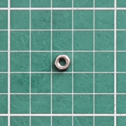 | 1 | <h4>M4 Hex Nut Nylon</h4> The nut can be used as a spacer between the S-132 PCB and the acrylic back of the IMSAI80080/Cromemco Z-1 |
|  | 1 | <h4>M3x5mm Zinc Machine Screw & Washer</h4> The M3 machine screw, washer and nut are used to secure the LM7805 to the S-132 PCB, to aide thermal conduction with the PCB. |
|  | 1 | | <h4>M3 Nut</h4> |

## Joystick Adapter (yellow)

| Part | Quantity | PCB | Description |
| ---- | --------:| --- | ----------- |
|  | 1 |  Pin 1 | <h4>40 Pin Header (20x2)- Horizontal</h4> Fit to underside of PCB. |
|  | 2 |  Pad 1, Pad 2 | <h4>8 Pin Header (4x2)- Horizontal</h4> Fit to top of PCB. |
|  | 8 |  R100 - 107 | <h4>10K Ohm Resistor [Brown, Black, Orange, Gold]</h4> |
|  | 1 |  A.Gnd | <h4>2 Pin Header - Vertical</h4>Cut from 20 Pin male header |
|  | 1 |  Ref.Voltage| <h4>3 Pin Header - Vertical</h4>Cut from 20 Pin male header |
|  | 1 |  Audio Patch | <h4>3 Pin Header - Vertical</h4>Cut from 20 Pin male header |
|  | 1 |  Amp | <h4>3 Pin Header - Vertical</h4>Cut from 20 Pin male header |
|  | 4 |  For A.Gnd, Ref.Voltage & Audio Patch as required | <h4>Header Pin Shunts</h4>Fit a shunt to both **A.Gnd** and the _+5V_ & _Center_ pins of **Ref.Voltage** |
| NOT SUPPLIED NOT REQUIRED | 1 |  C100 | <h4>100 nF (104) MLC Capacitor</h4> |
| NOT SUPPLIED NOT REQUIRED | 1 |  C101 | <h4>1 uF (105) MLC Capacitor</h4> |
| NOT SUPPLIED NOT REQUIRED | 1 |  MCP1541 | <h4>MCP1541 4.096V Voltage Reference</h4> |

| Part | Quantity | Description |
| ---- | --------:| ----------- |
|  | 2 x 36 inch | <h4>8-core IDC Ribbon Cable</h4>Connects JS-1 Joysticks to the Joystick Adapter |
|  | 4 | <h4>8-pin IDC Ribbon Cable Header - Female</h4>Connects JS-1 Joysticks to the Joystick Adapter |
|  | 1 | <h4>Front view</h4> |

## JS-1 Analog Joystick (yellow x 2)

| Part | Quantity | PCB | Description |
| ---- | --------:| --- | ----------- |
|  | 4 each |  SW1 - 4 | <h4>Tactile Push Button Switch SPST</h4> |
|  | 1 each |  | <h4>2-axis Analog Joystick - 10Kohm</h4> |
|  | 1 each |  | <h4>8 Pin Header (4x2)- Horizontal</h4> Fit to top of PCB. |

| Part | Quantity | Description |
| ---- | --------:| ----------- |
|  | 2 | <h4>Front view</h4> |

## Parallel Printer (red)

| Part | Quantity | PCB | Description |
| ---- | --------:| --- | ----------- |
|  | 1 |  Pin 1 | <h4>40 Pin Header (20x2)- Horizontal</h4> Fit to underside of PCB. |
| 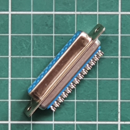 | 1 |  Printer | <h4>DB25 Female Socket - Solder lug</h4> |

| Part | Quantity | Description |
| ---- | --------:| ----------- |
|  | 1* | <h4>Front view</h4> |

## Prototype Adapter (green)

| Part | Quantity | PCB | Description |
| ---- | --------:| --- | ----------- |
|  | 1 |  Pin 1 | <h4>40 Pin Header (20x2)- Horizontal</h4> Fit to underside of PCB. |

| Part | Quantity | Description |
| ---- | --------:| ----------- |
| 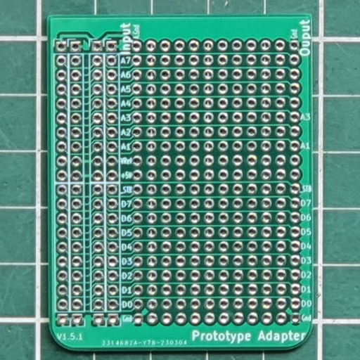 | 1* | <h4>Front view</h4> |