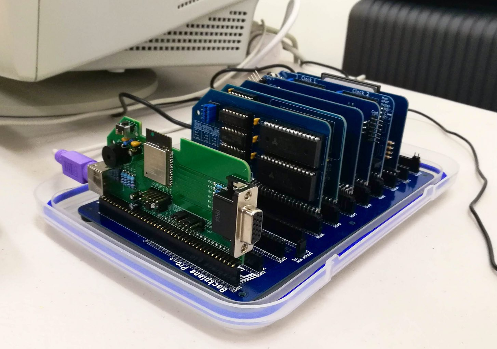

# VT132

 
Designed for RC2014

## Overview

I first tweeted about the VT132 in [March 2019](https://twitter.com/TheHighNibble/status/1110861587751927811)
I had put together a first prototype in time for mVCF - Melbourne (AUS)

Back then it was simply the hardware implementation of the brilliant work done by Fabrizio Di Vittorio in creating the [FabGL library](http://www.fabglib.org/) for the ESP32. An ANSI/VT compatible, serially connected terminal with VGA output and a PS/2 keyboard.

But I wanted to extend his work and make a very authentic implementation of the DEC VT100 down to every reasonable detail.

Clearly from the prototype I'd already chosen the form-factor to be a "Designed for RC2014" expansion card for the RC2014 bus.

I then took a break from the VT132 while I worked to finish another little project - the [IMSAI 8080 replica](/imsai8080/)

In [January 2020](https://twitter.com/TheHighNibble/status/1215533158717775872) I again tweeted about the VT132 because I'd started to play around with it once more.

I'd added most of the authentic VT100 features I could think of, and decided that since the ESP32 has lots of UARTS and WiFi, that I would include a Telnet over WiFi, AT (Hayes) style modem on a second UART. I'd already developed the modem code for the IMSAI8080 replica, so it was easy to integrate it into the VT132.

This is where the fun/trouble began...

- FabGL is an Arduino library. Running FabGL @ 800x600 native resolution (800x300 scanline doubled) consumes a lot of the ESP32s internal memory.
- Turning on WiFi in the Arduino environment on an ESP32 also consumes a lot of the ESP32s internal memory.
- Moving to the ESP32-WROVER with 8Mb of SPRAM helps a little, but it's still the internal memory that is the limiting resource.
- The Arduino IDE for ESP32 doesn't let you control and fine-tune all the memory and network resource allocation like the ESP-IDF does.
- But Espressif thought of that...
  - It is possible to run the Arduino library as a component in the ESP-IDF environment.
  - I was easily able to make FabGL behave as an ESP-IDF component too.

By April 2020 I was able to start posting [videos to YouTube showcasing the features of the VT132](https://www.youtube.com/playlist?list=PLADkYVZqAxdO1fTDprnp_jRCTQ-9n1OIV).

In June & July 2020 I conducted a closed Beta programme with some fantastic people from the Retro-computer community. Their contribution to improving the VT132 and accelerating the development, ready for production has been invaluable.

In July 2020 the VT132 began shipping to the patiently waiting early-adopters.

## Features

### VT100 Terminal

The VT100 Terminal:

- connects to the RC2014 over the Tx/Rx lines (Pins 35 & 36) of the RC2014 Bus
- takes power from the bus from Gnd/5V (Pins 17 & 18)
- fully DEC VT100 Escape Code compatible
  - extended escape code support from other DEC VTxxx models
  - extended ANSI.SYS escape code support
  - to be detailed on another page (tba)
- 800x600 native resolution over VGA (DB15 connector) - actually 800x300 with scanline doubling
  - 800x240 viewport in 24 line (native) mode
  - 800x250 viewport in 25 line (enhanced) mode
  - 800x300 viewport in 30 line (enhanced) mode (excludes the use of Wi-Fi because of memory constraints)
- 10x10 character cells in 80 column mode
  - original DEC VT100 font (ASCII 7-bit) with pixel stretching as per the original VT100 hardware
  - original DEC Special Graphics overlay font (inc. line drawing characters)
  - original DEC VT220 Multinational Character Set (MCS) font (8-bit)
  - DEC National Replacement Character Set (NRCS) support (7-bit) (from VT220)
    - implemented for US/UK/Germany/Italy, other countries to follow
  - PC/VGA Code Page 437 font for ANSI.SYS compatibility
    - supports DEC Special Graphics mapping to CP437
    - supports NRCS mapping to CP437
- 6x10 character cells in 132 column mode
  - modified DEC VT100 font (ASCII 7-bit)
  - modified DEC Special Graphics overlay font (inc. line drawing characters)
  - modified DEC VT220 Multinational Character Set (MCS) font (8-bit)
  - DEC National Replacement Character Set (NRCS) support (from VT220) see above.
  - no CP437 support in 132 column mode
- accurate Smooth Scrolling (requires XON/XOFF as per the original VT100 to avoid dropped characters)
- interlace/non-interlace mode (simulated: doubled scanlines are either hidden or drawn)
- PS/2 Keyboard (Mini-DIN 6, PS/2 connector)
  - supports keyboard layouts for US/UK/Germany/Italy, other countries to follow
- implements all VT100 Advanced Video Option (AVO) features
  - 132x24 (native), 132x25 & 132x30 (enhanced) character resolution
  - additional character attributes - Bold, Blink, Underline, Reverse (and combinations)
  - additional character ROM (NRCS and MCS fonts)
- implements user programmable answer back as per VT100
- implements a physical buzzer on the PCB for
  - keyclick
  - bell (^G)
  - margin bell
  - NVRAM error notification
  - non-blocking (operates on a timer interrupt and does not block serial communications)
- implements 16 colour support
  - complies with ANSI escape code selection
  - use selectable default text and background colours via additional Set-up C screen
- full VT100 style Set-up screen implementation
  - Activated by *Alt-SysReq* key-press (usually *Alt-PrintScreen*)
  - Set-up A (native as per VT100 with minor modifications)
    - added 'T' command to restore default Tab-Stops (from VT102)
  - Set-up B (native as per VT100 with minor modifications)
    - added 'C' command to clear NVRAM
    - 50/60Hz bit replaced by Backarrow Key Mode selection bit (DECBKM)
    - added selection of how **Bold** font is represented (bright &/or double-thick)
    - added selection of **ANSI.SYS** mode compatibility
    - baud rates supported - 300, 1200, 2400, 4800, 9600, 19200, 38400, 57600, 115200
    - fixed serial format 8N1, no current support for 7 bits, parity or 2 stop bits
  - Set-up C (enhanced) enables:
    - DEC/VT font or CP437 font selection
    - 24 line (native) / 25 line / 30 line (enhanced) mode selection for ANSI compatibility
    - default foreground text colour selection, 1 of 16 colours
    - default background colour selection, 1 of 16 colours
    - ANSI or VGA 16 colour palette selection
  - Set-up D (enhanced) enables:
    - 7-bit ASCII (native) / 8-bit MCS selection (enhanced)
    - 7-bit NRCS country selection
    - keyboard country/language selection
    - personality selection
      - personality (escape code and keyboard code translation) support for:
        - ANSI/VT100, ADM-3A, ADM-31, Hazeltine 1500, Osborne 1, Kaypro, VT52
        - WordStar/VT100 - VT100 terminal with WordStar navigation keys for compatibility with many CP/M applications
        - details to follow on a separate page (tba)
  - all Set-up screens include optional help by pressing 'F1' key (enhanced)
- Quick Menu system (modeled on the VT510 setup menus)
  - Activated by *LeftAlt-Esc* key-press
  - Provides quick access to:
    - common actions, eg. clear screen, reset, reboot, clear NVR
    - terminal personality selection
    - MCS/NRCS mode selection
    - macros for ASCII modes including:
      - Green/Amber/Blue/White screen emulation
      - ANSI.SYS mode compatibility
    - keyboard country/language selection
    - modem locally connected mode (direct VT100 to modem connection)
    - online/local mode selection
- Non-volatile Storage (NVRAM) support for all terminal settings
  - save settings function - 'S' in Set-up screens
  - restore settings function - 'R' in Set-up screens
  - settings are restored on reset and power-up

Full details of configuring the terminal via the Set-up screens is covered in the [VT100 Operator Information Manual](operation/vt100/operator/)

### Telnet/WiFi AT (Hayes) Modem

The Telnet/WiFi AT (Hayes) Modem:

- connects to the RC2014 over the Tx2/Rx2 lines (Pins 35 & 36) of the RC2014 Enhanced Bus
- takes power from the bus from Gnd/5V (Pins 17 & 18)
- includes a dedicated 6-pin FTDI header with dedicated UART for (re)programming and for debug log monitoring
- implements a minimal set of 'AT' commands enabling it to behave as a serially connected modem
- supports storing all 'S' register settings in non-volatile storage (NVRAM)
- settings can be restored from NVRAM or restored to 'factory' defaults
- settings are restored from NVRAM on reset and power-up
- support 'DIAL' mode for outbound connections to hosts
- supports 'ANSWER' mode for inbound connections including simulated 'RING' cycle
- does not aim to reproduce every feature and command of any specific Hayes modem
- connects to a WiFi access point over 2.4 GHz (802.11 b/g/n) as a WiFi station (STA mode)
- cannot currently act as a WiFi access point (AP mode) - but this would be possible if it is a feature that people want
- supports Telnet and TCP socket protocols for connecting to hosts
- supports serial baud rates of 4800, 9600, 14400, 19200, 38400, 57600, 1152000 from the UART
  - making it compatible with all the speeds of the [RC2014 Dual Serial Module SIO/2](https://rc2014.co.uk/modules/dual-serial-module-sio2/) or similar
  - does not currently support 'autobaud'
    - but is selected by the 'Prog' press button switch on the PCB
    - the chosen speed is stored in NVRAM and persists through resets and power cycling
- supports CTS/RTS hardware flow-control over a 6-pin modified FTDI style modem header (not the RC2014 Enhanced Bus)
  - making it compatible with the [SC104 Z80 SIO/2 Module](https://smallcomputercentral.wordpress.com/sc104-z80-sio-2-module-rc2014/) with CTS/RTS flow-control

A full list of the 'AT' command set implemented and details of all the 'S' registers and their use is covered in the ['AT' (Hayes) Serial Modem Operation Manual](operation/modem/)

### Over-the-Air (OTA) Firmware Updates

- Firmware updates are hosted on [GitHub](https://github.com/thehighnibble/vt132)
- The current production firmware (V1.0.0) can always be found at [github.com/thehighnibble/vt132/releases/latest](https://github.com/thehighnibble/vt132/releases/latest)
- OTA Updates can be performed directly from the VT132 over Wi-Fi with only power, a VGA monitor and PS/2 keyboard connected, no connected RC2014 or PC is required

The process for OTA Updates is covered in the [OTA Updates Manual](operation/ota/)

## Availability

The VT132 is currently available (since July 2020) and has a price of USD$50. In addition to this you must pay for shipping and any transaction fees. Payment is via PayPal.

### To Order

I am accepting orders via email. If you send email to [info@thehighnibble.com](mailto:info@thehighnibble.com) with your shipping name & address, I will respond to you with a PayPal invoice with the total price including shipping and transaction fees.

::: tip
Please only pay against the PayPal invoice when I send it to you. Do not try to pay directly to me via PayPal as this will only delay your order.
:::

## Specifications

### Dimensions (built)

Designed for RC2014

Conforms to standard RC2014 card dimensions

### Weight (built)

0.1 lbs

0.045 kg

### Power

5VDC @ 500 mA (max., < 100mA typical) - Powered from RC2014 Bus or via FTDI or Modem connectors (jumper selectable).

### Dimensions (boxed/shipped)

7 1/2" x 5.5" x 2"

190mm x 140mm x 50mm

(width x height x depth)

### Weight (boxed/shipped)

less than 0.44 lbs

less than 0.2 kg

## [Bill-of-Materials](bom/)

## [Operation Manual](operation/)
