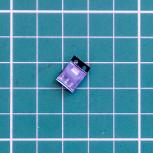
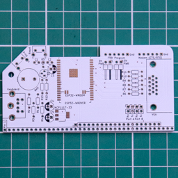

# VT132 Bill of Materials (Draft)

::: danger Note:
The BOM is yet to be updated to include details of 

- the **Stand Alone edition**
- the USB interface for USB-HID keyboard support

The parts listed below are common for both editions with the exception of:

- the Through Hole (THT) headers supplied
- the Printed Circuit Board (PCB)
:::

::: tip
To see the images in full size you can right-click on an image and `Open Image in New Tab`
:::

::: warning Notes on the PCB

- The silk screen on the Beta Kit PCBs (V1.3) is not final
- Part identifiers are correct and there are no known errors
- Graphic decals and label placement are not final
:::

## Surface Mount Device (SMD) components

::: tip Don't Panic

- Yes there are two SMD components!
- You can do it!
- You can do it with a regular soldering iron, but you are going to need flux
:::

| Part | Quantity | PCB | Description |
| ---- | --------:| --- | ----------- |
|  | 1 | ESP32-WROVER U1 | <h4>ESP-32 WROVER Module</h4> |
|  | 1 | NCP1117-33 U2 | <h4>NCP1117-33 LDO Linear Regulator</h4> |

## Through Hole (THT) components

| Part | Quantity | PCB | Description |
| ---- | --------:| --- | ----------- |
|  | 2 |  R1, R2 | <h4>120 Ohm Resistor [Brown, Red, Black, Black, Gold]</h4> |
|  | 2 |  R3, R4 | <h4>2K Ohm Resistor [Red, Black, Black, Brown, Gold]</h4> |
|  | 1 |  R5 Vertical | <h4>10K Ohm Resistor [Brown, Black, Black, Red, Gold]</h4> |
|  | 3 |  R6, R8, R10 | <h4>806 Ohm Resistor [Grey, Black, Blue, Black, Gold]</h4> |
|  | 3 |  R7, R9, R11 | <h4>405 Ohm Resistor [Yellow, Black, Green, Black, Gold]</h4> |
|  | 1 |  R12 | <h4>4.7K Ohm Resistor [Yellow, Purple, Black, Brown, Gold]</h4> |
|  | 1 |  R13 | <h4>10K Ohm Resistor [Brown, Black, Black, Red, Gold]</h4> |
|  | 1 |  C1 | <h4>100 nF (104) MLC Capacitor</h4> |
|  | 1 |  C2 | <h4>1 uF MLC (105) Capacitor</h4> |
|  | 1 |  C3 | <h4>100 uF Electrolytic Capacitor</h4> Electrolytic capacitors have polarity, ie. they must be inserted the correct way around to function properly.|
|  | 1 |  C4 | <h4>22 uF Electrolytic Capacitor</h4> Electrolytic capacitors have polarity, ie. they must be inserted the correct way around to function properly.|
|  | 1 |  C5 | <h4>10 uF Electrolytic Capacitor</h4> Electrolytic capacitors have polarity, ie. they must be inserted the correct way around to function properly.|
|  | 1 |  Q1 | <h4>S8050 NPN Transistor TO-92</h4> |
|  | 2 |  Prog, Reset | <h4>Tactile Push Button Switch SPST - Right Angled</h4> |
|  | 1 |  Bell | <h4>Buzzer 12.2mm dia.</h4> The Buzzer is polarized, ie. it must be inserted the correct way around to function. +VE to the Square Pad |

## Through Hole (THT) headers

| Part | Quantity | PCB | Description |
| ---- | --------:| --- | ----------- |
|  | 2 |  JP5, JP6 5V Pwr | <h4>2 Pin Header - Horizontal</h4> |
|  | 2 |  FTDI Program, Modem Port B | <h4>6 Pin Header - Horizontal</h4> |
|  | 1 |  JP1 to JP4 RxA/TxA RxB/TxB | <h4>8 Pin Header (4x2)- Vertical</h4> |
|  | 1 |  Pin 1 | <h4>80 Pin Header (40x2)- Horizontal</h4> RC2014 Pro Bus Connector. Remove the unneeded pins from the upper row. |
|  | 6 |  For JP1 to JP6 as required | <h4>Header Pin Shunts</h4> To be placed only on JP1 to 4 for normal operation. |

## Through Hole (THT) connectors

| Part | Quantity | PCB | Description |
| ---- | --------:| --- | ----------- |
|  | 1 |  VGA | <h4>DB15 VGA Female Socket - Right Angled</h4> |
|  | 1 |  Keyboard | <h4>Mini-DIN-6 PS/2 Keyboard Female Socket - Right Angled</h4> |

## Printed Circuit Board (PCB)

| Part | Quantity | Description |
| ---- | --------:| ----------- |
|  | 1* | <h4>Back view</h4> |
|  | 1* | <h4>Front view</h4> |
