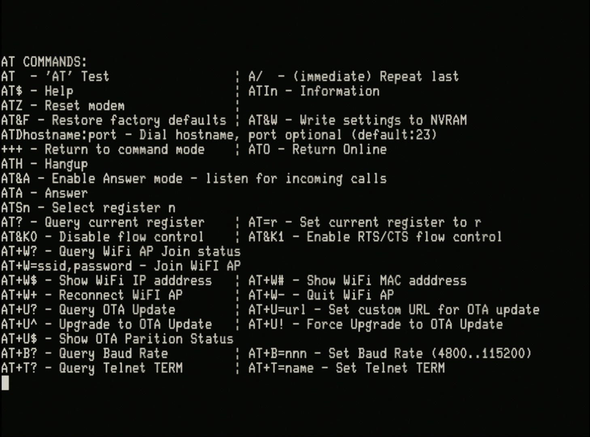

# 'AT' (Hayes) Serial Modem Operation Manual (Draft)

## Background

Unlike the VT100 terminal, the modem does not try to faithfully emulate any particular original device.

Instead it is designed to provide an MVP (minimum viable product) providing a modified [Hayes 'AT'](https://en.wikipedia.org/wiki/Hayes_command_set) **compatible** command set for connecting over Wi-Fi via TCP/IP sockets with an optional [Telnet protocol](https://en.wikipedia.org/wiki/Telnet) layer.

Although later standardized by the TIA/EIA, in the early days of dialup modems the **'AT' command set** of the Hayes SmartModem was copied by other modem makers and became a de-facto standard or rather a **convention**, as other modem manufacturers took the liberty to alter and extend the 'AT' command set. The same applied to the so called **'S' Registers** where settings and configuration are made and saved to non-volatile storage (NVS).

See [Hardware Configuration](../#hardware-configuration) for details on connecting from a UART on your RC2014 to the modem.

## 'AT' Commands

::: tip
The original 'AT' command set was strictly in upper case. This is because the bit sequence of the ASCII values for 'A' and 'T' have a specific property that enables [autobaud detection](https://en.wikipedia.org/wiki/Hayes_command_set#Autobaud) of the connection to the data terminal equipment (DTE).

- The modem only responds to 'AT' commands in upper case.
:::

::: tip

- Commands are terminated by `<CR>` (carriage return, `<ctrl>-m`, `0x0D`, decimal 13) usually generated by the `Enter` or `Return` key on your keyboard.
- Commands can by edited, before pressing `<CR>`, using `<BS>` (backspace, `<ctrl>-H`, `0x08` decimal 8) to erase the previous character entered. You may need to configure the terminal to generate `<BS>` when you press the `Backspace` or `<-` key on your keyboard.
:::

::: warning
The 'AT' command processor is based on a finite state machine (FSM). If you type anything that is not recognized by the rules of the FSM you will immediately see an `Error` message.
:::

### 'AT' Command Help

Typing `AT$` when connected to the modem will result in the following 'AT' command summary being returned by the modem.

::: tip

- All commands must be prefixed with `AT` except for the **immediate** command `A/`.
- Commands can be concatenated into a single command string, except in the cases where the command accepts all the remaining input up to the `<CR>` as part of the command.
- See the table below for examples.
:::

::: warning
The maximum length command string that can be entered is **80** characters.
:::

Each command is explained in the following table.

### 'AT' Command Summary Table

| Command | Description | Comments/Examples |
| ------- | ------------| ----------------- |
| **AT** | 'AT' test | `AT` entered on its own will respond `OK` and tests that command processor is responding | 
| **A/** | Repeat last command (immediate) | This **immediate** command is **not** prefixed by `AT` but repeats the last command entered as soon as `A/` is entered ie. it does not wait for a `<CR>`  |
| **$** | Help | Responds with the 'AT' Command Help [see above](#at-command-help) |
| **I** or **I0** | Information zero | Responds with the modem model string `VT132 'AT' Modem` |
| **I1** | Information one | Responds with the modem firmware version string eg. `V1.0.0` |
| **I2** | Information two | Responds with the modem firmware build chain version string eg. `V4.0-1234` |
| **Z** | Reset modem | Soft resets the modem. Reloads settings and 'S' Registers from NVS. Closes open TCP/IP connections. But does not disconnect from the Wi-Fi Access Point (AP) if connected |
| **&F** | Restore factory defaults | Return the current settings and 'S' Registers to factory defaults. But does not save these to NVS |
| **&W** | Write settings to NVS | Writes the current settings to NVS. This takes approximately 10 seconds, during which the modem appears frozen. The modem will respond `OK` when the write is complete |
| **D** | Dial (TCP/IP connect) | The full form is `ATDhostname:port` where *hostname* is either the IPV4 address in `nnn.nnn.nnn.nnn` notation or the DNS name of the host. The `:port` is optional and specifies a *numeric TCP/IP port number* for the connection, the default is `23`. There are a number of possible error conditions explained below under [Wi-Fi Connection Results](#wi-fi-connection-results). If the connection is successful the modem will enter **Data Mode** |
| +++ | Escape Sequence | When connected and in **Data Mode** the *Escape Sequence* will return to **Command Mode**. The `+++` *Escape Sequence* is only recognised if surrounded by a guard interval of 1 second ie. there must be a one second pause before and after entering `+++` or it will not be recognised but simply treated as part of the data stream |
| **O** | Return Online | When connected and in **Command Mode** `ATO` will return to **Data Mode**. If not connected the modem will respond `NO CARRIER` |
| **H** | Hangup | When connected and in **Command Mode** `ATH` will close the connection. If a connection is closed the modem will respond `HANGUP` |
| **&A** | Enable Answer mode | Unless `AT&A` is entered the modem will not respond to requests for incoming connections. See [Answer Mode](#answer-mode) below for details |
| **A** | Answer | When an incoming connection request is indicated by the modem responding `RING` the request can by manually accepted with the `ATA` command. If the connection is successful the modem will enter **Data Mode** |
| **Sn** | Select current register | Select register *n* as the current 'S' register |
| **?** | Query current register | The modem will respond with the value of the current 'S' register. If no register has been selected the default is zero (0). As commands can be concatenated it is normal to append this to the `Sn` command to query a specific register eg. `ATS15?` will query the value of 'S' Register 15 |
| **=r** | Set current register | Sets the value of the current 'S' register to *r*. If no register has been selected the default is zero (0). As commands can be concatenated it is normal to append this to the `Sn` command to set a specific register eg. `ATS15=1` will set the value of 'S' Register 15 to 1 |
| **&K** or **&K0** | Disable CTS/RTS flow control | The 6-pin modem header provides CTS/RTS lines. `AT&K0` disables their operation. This is the default |
| **&K1** | Enable CTS/RTS flow control | The 6-pin modem header provides CTS/RTS lines. `AT&K1` enables their operation |
| **+W?** | Query Wi-Fi Access Point (AP) connection status | Responds with the status of the Wi-Fi connection as a string. The possible responses are listed below under [Wi-Fi Connection Results](#wi-fi-connection-results) |
| **+W=sss,ppp** | Join Wi-Fi Access Point (AP) | Connects to the Wi-Fi access point with **SSID** - *sss* and **password** - *ppp*. The modem responds `OK` immediately but the connection happens asynchronously so the status of the connection should be checked with `AT+W?` or `AT+W$`. The **SSID** and **password** are immediately stored in NVS regardless of whether they are valid or the connection was successful |
| **+W$** | Show Wi-Fi IP address | Responds with the IP address allocated to the modem from the AP by DHCP. If the connection has not completed or has been unsuccessful the IP address returned will be `0.0.0.0` |
| **+W#** | Show Wi-Fi MAC address | Responds with the MAC address of the modem. No connection is required, the MAC address is always available |
| **+W+** | Reconnect to Wi-Fi AP | Reconnects to the AP using the **SSID** and **password** stored in NVS. If the modem is already joined to the AP, the connection is first disconnected and then reconnected |
| **+W-** | Disconnect from Wi-Fi AP | Disconnects from the AP |
| **+B?** | Query Baud Rate | Responds with the current baud rate configured for the connection to the DTE |
| **+B=n** |  Set Baud Rate | Sets the current baud rate to a supported value closest to *n*. The supported speeds are 4800, 9600, 14400, 19200, 38400, 57600, 115200. After the command is entered there is a 5 second delay before the baud rate is changed to allow changes to be made on the DTE before the modem responds. The new baud rate is immediately stored in NVS |
| **+T?** | Query Telnet TERM environment variable | Responds with the current string value of the TERM environment variable that will be used by the Telnet protocol layer when negotiating the **TERMINAL-TYPE** option. If no value has been set, or has been cleared, the default value `vt100` will be used |
| **+T=ttt** | Set Telnet TERM environment variable | Sets the current string value of the TERM environment variable to *ttt*. The Telnet protocol layer will use this value when negotiating the **TERMINAL-TYPE** option. If the command includes no value and is given only as `AT+T=` then the TERM environment variable is cleared and the default value will be used in future. The new value is immediately stored in NVS.

## 'S' Registers

There are a total of 51 'S' Registers reserved in the modem, `S0` to `S50`. 

Most of them are undefined and unused. The defined registers are set with default values but some registers are ignored as their purpose is typically not useful, this is indicated in the table below. Changing the value of a register that is ignored will have no effect on the operation of the modem.

'S' Registers originally held only 8-bit (byte) values. In this implementation registers are 16-bit.

### Defined 'S' Registers

| Register | Description | Range | Default Value | Used |
| ---|---- | ------------| ------| ------------- | ---- |
| S0 | Number of rings before Auto-Answer | 0–255 (0 = never) | 0 | Yes |
| S1 | Ring Counter | 0–255 rings | 0 | Yes |
| S2 | Escape character | 0–255, ASCII decimal | 43 ('+') | Ignored |
| S3 | Carriage Return Character | 0–127, ASCII decimal | 13 (Carriage Return) | Ignored |
| S4 | Line Feed Character | 0–127, ASCII decimal | 10 (Line Feed) | Ignored |
| S5 | Backspace Character | 0–32, ASCII decimal | 8 (Backspace) | Ignored |
| S14 | TCP/IP Port number for **Answer Mode** | 0-65535 | 23 | Yes |
| S15 | Telnet Protocol  for **Data Mode** | 0 - disabled, 1 - enabled | 0 | Yes |
| S16 | Negotiate Telnet **SGA** | 0 - Won't/Don't, 1 - Will, 2 - Do, 3 - Will/Do | 3 | Yes |
| S17 | Negotiate Telnet **ECHO** | 0 - Won't/Don't, 1 - Will, 2 - Do, 3 - Will/Do | 3 | Yes |
| S18 | Negotiate Telnet **BIN** | 0 - Won't/Don't, 1 - Will, 2 - Do, 3 - Will/Do | 0 | Yes |
| S19 | Negotiate Telnet **NAWS** | 0 - Won't/Don't, 1 - Will, 2 - Do, 3 - Will/Do | 3 | Yes |
| S20 | NAWS Negotiate **Columns** | 0-255 columns | 80 | Yes |
| S21 | NAWS Negotiate **Rows** | 0-255 rows | 24 | Yes |
| S22 | Negotiate Telnet **TERMINAL-TYPE** | 0 - Won't/Don't, 1 - Will, 2 - Do, 3 - Will/Do | 3 | Yes |
| S39 | CTS/RTS Flow Control | 0 - disabled, 1 - enabled, set by `AT&K` command | 0 | Yes |

## Wi-Fi Connection Results

::: warning
Wi-Fi **cannot** be started when the terminal is in **30 line** mode due to the limited amount of internal memory in the EPS32.

If you attempt to (re)connect the Wi-Fi when in this mode you will receive the response: `WIFI ERROR`

Return the terminal to **24 or 25 line** mode and you will be able to (re)connect the Wi-Fi.
:::

### Dial Responses

The following table details the responses from the modem for the **Dial** command `ATDhostname:port`

| Response | Reason for Response |
| -------- | --------------------|
| `NO DIALTONE` | when no Wi-Fi connection has been established with an AP |
| `ALREADY IN CALL` | when a connection is already established ('Dialed' or 'Answered') with another host |
| `ERROR` | when no *hostname* is provided |
| `NO ANSWER` | when a TCP/IP socket **can't be opened** with the *hostname:port* |
| `CONNECT` | when a TCP/IP socket **is opened** with the *hostname:port* |

### Query Wi-Fi Responses

The following table details the responses from the modem for the **Query Wi-Fi Access Point (AP) connection status** command `AT+W?`

| Response | Description |
| -------- | ------------|
| `WIFI NOT STARTED` | when no Wi-Fi connection has been attempted since power-on or hardware reset |
| `WIFI IDLE` | if Wi-Fi status is queried during a connection attempt |
| `WIFI NO SSID`| when no AP with the given SSID/password is found following the `AT+W+` or `AT+W=` commands |
| `WIFI CONNECTED` | following a **successful** connection to an AP with the `AT+W+` or `AT+W=` commands |
| `WIFI CONNECT FAILED` | tba |
| `WIFI CONNECTION LOST` | following a lost connection with the AP |
| `WIFI DISCONNECTED` | following an **unsuccessful** connection attempt, or a **successful** disconnection with the `AT+W-` command |

## Telnet Protocol

The [Telnet protocol](https://en.wikipedia.org/wiki/Telnet) in normally considered an optional layer when establishing TCP/IP socket connections with remote hosts to operate as a Network Virtual Terminal (NVT).

Some hosts will provide a more functional service if Telnet is negotiated.

The Telnet daemon `telnetd` I have on MacOS won't accept a connection if Telnet is not negotiated.

When Telnet is **not enabled**, TCP/IP socket connections are 8-bit clean. With Telnet **enabled** only one value, `0xFF` known as the IAC byte (Interpret As Command) is overloaded to indicate that the next byte is a Telnet command. Telnet must negotiate binary mode (BIN) to transmit binary files.

::: tip
If connecting to a remote  **c-Kermit server** ie. under c-Kermit on a remote host enter the command `set host /server * 8080`

**DO NOT** enable the Telnet protocol as you are not acting as an NVT in this use-case and c-Kermit doesn't expect Telnet.
:::

### Telnet Options Implemented

The modem implements the following minimum set of Telnet *options*:

- [SGA (Suppress Go Ahead)](https://tools.ietf.org/html/rfc858)
- [ECHO](https://tools.ietf.org/html/rfc1073)
- [BIN (Binary Transmission)](https://tools.ietf.org/html/rfc856)
- [NAWS (Negotiate About Window Size)](https://tools.ietf.org/html/rfc1073)
- [TERMINAL-TYPE](https://tools.ietf.org/html/rfc1091)

Each Telnet *Option* is negotiated in via a request/response exchange described as Do/Don't (request) and Will/Won't (response). Trying to understand how these work for each *Option* usually requires reading the RFC (linked in the list above) and extreme patience and experimentation.

Usually you either want an *Option* completely **On** (Do/Will) or **Off** (Don't/Won't).

Setting the supported *Options* and their default values are defined via specific ['S' Registers detailed above](#defined-s-registers).

In summary the defaults are:

| Option | Default | Description |
| ------ | ------- | ----------- |
| SGA | Do/Will | SGA is required for the NVT to work character by character and not in linemode |
| ECHO | Do/Will | tba |
| BIN | Don't/Won't | To operate as an NVT, binary mode is not required. File transfer protocols like KERMIT and XMODEM do their own binary encoding |
| NAWS | Do/Will | The remote host can learn your terminal windows size in characters, the default is `80 x 24` set in `S20` and `S21` respectively |
| TERMINAL-TYPE | Do/Will | The remote host can learn your terminal type, the default is `vt100` |

::: tip
TERMINAL-TYPEs must be known by the remote system to be recognised.

When connecting to `telnetd` on MacOS I use `vt100+` from the `terminfo` database which provides support for color over and above the standard `vt100` terminal type, making text applications like `htop` work as expected and in color.
:::

### Enabling Telnet Protocol

Telnet protocol is **not enabled** by default.

- To **enable** the Telnet protocol you must manually set 'S' Register `S15` to `1` with `ATS15=1`
- To **disable** the Telnet protocol you must manually set 'S' Register `S15` to `0` with `ATS15=0`

The Telnet protocol is applied to **both** *outgoing connections* 'Dialed' with `ATD` and *incoming connections* 'Answered' with `ATA` or **Auto-answer**.

### Telnet Protocol Framework

The Telnet protocol implementation in the modem is not fixed, but is instead based on a library [libtelnet](https://github.com/seanmiddleditch/libtelnet). There is further information about Telnet and Telnet *Options* on the GitHub repository for the library.

The library provides a framework for implementing any Telnet *Option*. So if there are *Options* that you feel are important beyond the minimum set already implemented let me know, providing a *compelling* use-case, and I will consider adding them.

## Answer Mode

Listening for incoming TCP/IP socket connections is **not enabled** by default.

- To **enable** listening for incoming TCP/IP socket connections you must manually enter `AT&A` to *Enable Answer Mode*.
- Answer Mode will remain enabled, and can only disabled by an `ATZ` Soft Reset, hardware reset or power-cycle.
- Incoming TCP/IP socket connections will cause the modem to respond with `RING`, repeated every three (3) seconds.
- As each `RING` occurs the Ring Counter in `S1` is incremented by one (1).
- The user can *Answer* the incoming call at any time with `ATA` and the modem will accept the TCP/IP socket connection and enter **Data Mode**.
- If the **Number of rings before Auto-Answer** is set in `S0` to a number greater than zero (0 = never) and `S1` is greater-then-or-equal to `S0` the modem will *Auto-answer*: accept the TCP/IP socket connection and enter **Data Mode**.
- If Telnet protocol is enabled by `ATS15=1` then the Telnet Protocol will be negotiated with the remote host after the modem enters **Data Mode**.
- The user can *Hangup* an incoming call by sending the *Escape Sequence* `+++` (with guard times) to return to **Command Mode** and then sending `ATH` to *Hangup*.
- A Hangup `ATH` will reset the Ring Counter in `S1` to zero (0).
