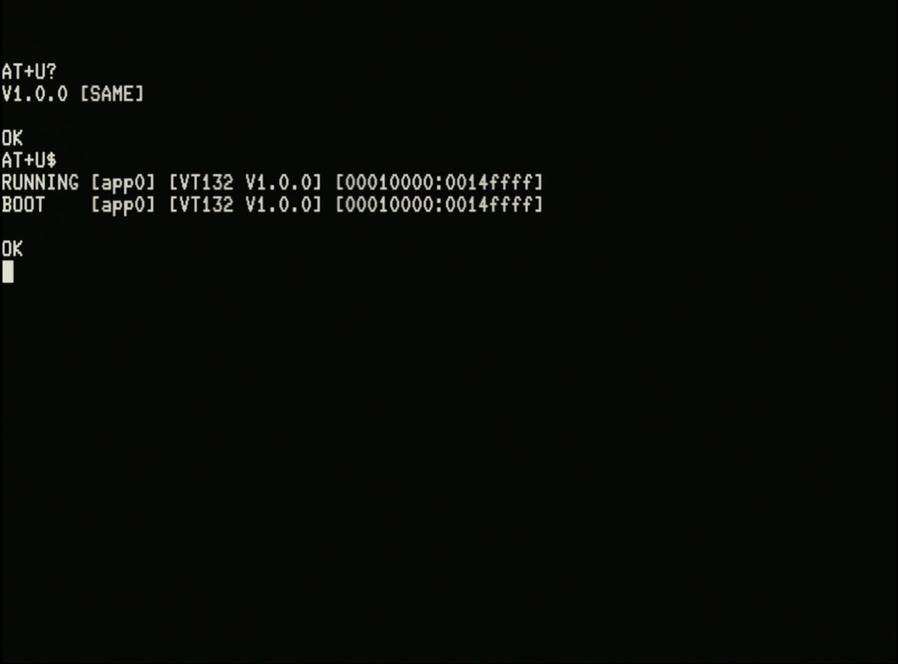

# Over-the-Air (OTA) Firmware Update Guide (Draft)

The OTA Update feature of the VT132 enables you to update the firmware of your VT132 to the latest release **without** having to connect your VT132 to a PC via the FTDI connector or install any utilities on your PC to flash new firmware to the ESP32 module.

OTA updates are performed via the 'AT' (Hayes) Modem interface using a series of 'AT' command extensions.

::: tip
From the modem prompt/command line you can type `AT$` for help to be reminded of the OTA 'AT' commands.
:::

::: tip
You can connect to the modem from your system using a terminal program such as **KERMIT** or **QTERM**

OR

You can enable the modem locally and connect directly from the VT100 to the modem in **LOCAL** mode. See the [Quick Menu Guide](../vt100/operator/quick-menu/) for details.
:::

## Update to latest version from GitHub repository (recommended)

The current firmware on GitHub is tagged as the *latest* release, so simply use the OTA update feature as follows:

From the modem prompt/command line:

- `AT+W+` or `AT+W=ssid,pwd` to join your Wi-Fi network
- `AT+U$` to see what firmware version you are currently running [optional]
- `AT+U?` to query GitHub for the latest firmware image
- should report `V1.1.0` (or similar)
  - following the version number, a self explanatory indicator of `[OLDER]`, `[SAME]` or `[NEWER]` will be shown
- `AT+U^` or `AT+U!` to upgrade or *force* the upgrade, depending on your current version
  - `AT+U^` will only work if the queried firmware image is `[NEWER]`
  - during the upgrade process a series of full-stops `...` will be output to indicate progress with the upgrade
  - when the upgrade completes downloading the new firmware image into flash memory the modem will respond with an `OK`
- `AT+U$` to see what firmware version you will boot next [optional]
- H/W reset after success with the download & flash
  - the new firmware image will only be run following a H/W reset or reboot

::: warning
Once you have entered the **Query OTA Update** command `AT+U?` the VT132 should not be expected to operate *"normally"* until you perform a H/W reset or reboot of the VT132.

This is because the **Query OTA Update** command opens and creates a number of files and large data structures in memory that may conflict with normal operation and these can only be closed and released by a H/W reset or reboot.
:::

::: tip
You can safely *force* upgrade `AT+U!` the firmware to the same version you are currently running if you simply want to "practice" the upgrade process.
:::

Example output from the **Show OTA Partition Status** `AT+U$` and **Query OTA Update** `AT+U?` commands is show here:

A full description of the OTA Update commands and their output will be added here later: TBA.

## Update to a version from a local web server

If you have a firmware image file or if you wish to install a firmware image **other** than the one tagged *latest* on the [GitHub firmware repository](https://github.com/thehighnibble/vt132/releases) you can stage that file on a local web server (ie. on the same network as the VT132 connects over Wi-Fi) and use a process similar to the one above, but with one extra command to provide the local address of the firmware image.

::: tip
The standard firmware image file is named `VT132.bin`
:::

Eg. With the firmware image file `VT132.bin` staged on the root of the "local" web server running on **port** `5500` with **DNS name** `mylocalserver` and **IPv4 address** of `192.168.1.20` proceed as follows:

From the modem prompt/command line:

- `AT+W+` or `AT+W=ssid,pwd` to join your Wi-Fi network
- `AT+U$` to see what firmware version you are currently running [optional]
- `AT+U=url_for_local_file` to set the URL to the file on the local web server, eg.:
  - `AT+U=http://mylocalserver:5500/VT132.bin` if using the DNS name, or
  - `AT+U=http://192.168.1.20:5500/VT132.bin` if using the IPV4 address
- `AT+U?` to query the local web server for the firmware image specified
- should report `V1.1.0` (or similar)
  - following the version number, a self explanatory indicator of `[OLDER]`, `[SAME]` or `[NEWER]` will be shown
- `AT+U^` or `AT+U!` to upgrade or *force* the upgrade, depending on your current version
  - `AT+U^` will only work if the queried firmware image is `[NEWER]`
  - during the upgrade process a series of full-stops `...` will be output to indicate progress with the upgrade
  - when the upgrade completes downloading the new firmware image into flash memory the modem will respond with an `OK`
- `AT+U$` to see what firmware version you will boot next [optional]
- H/W reset after success with the download & flash
  - the new firmware image will only be run following a H/W reset or reboot

## Update to a version using the ESP-IDF `epstool.py` utility

Instructions for flashing the firmware using the **ESP-IDF** `esptool.py` utility are included with the firmware downloadable from the [GitHub firmware repository](https://github.com/thehighnibble/vt132/releases)

If using this process to upgrade:
- download the `FIRMWARE.zip` file
- unzip the file
- read the `FLASHING.md` file for instructions

## For the security conscious

::: danger For the security conscious
OTA Updates from GitHub are performed using the **https** protocol.

Security certificates (Root CA) for **GitHub** and **Amazon S3** (where GitHub stores release binary files) are embedded in the firmware.

**https** requests to servers that use any other *Root CA* certificate will fail to authenticate.

Also, the VT132 makes this request as an **https client** and **does not** implement an http or https server.

Note also:

- A Wi-Fi connection to an Access Point is never established by default, but must be explicitly (re)connected using the `AT+W=` or `AT+W+` commands
- The only time the VT132 makes outgoing IP socket requests is when:
  - you dial a host with the `ATD` dial command
  - you initiate an OTA update transaction with the `AT+U?` Query OTA Update command and the subsequent `AT+U^` or `AT+U!` upgrade or *force* upgrade commands
- The only time the VT132 accepts incoming IP socket requests is when the modem is enabled for "Answer" mode with `AT&A` (not be default).
:::
