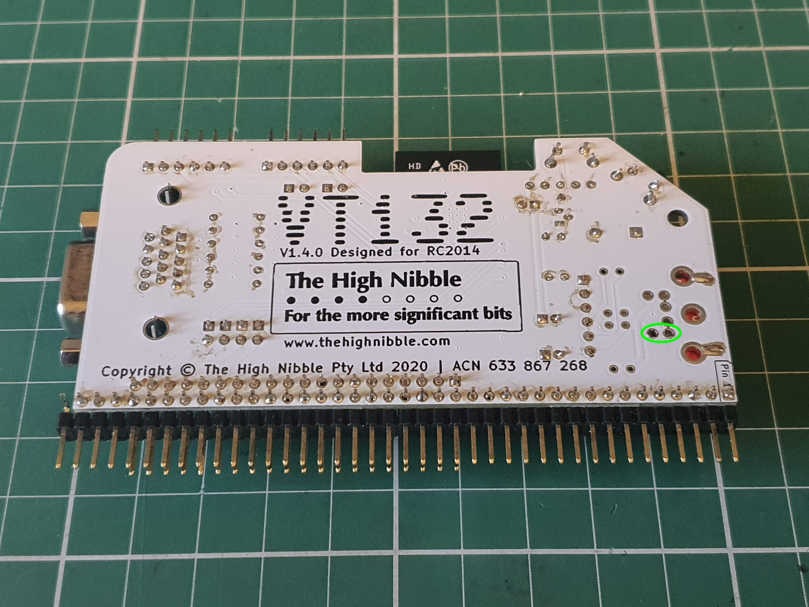
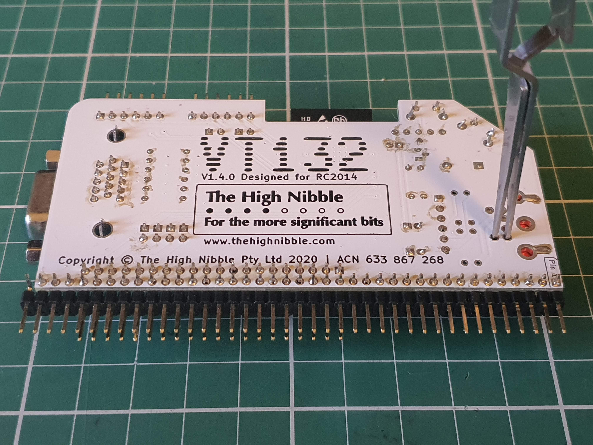
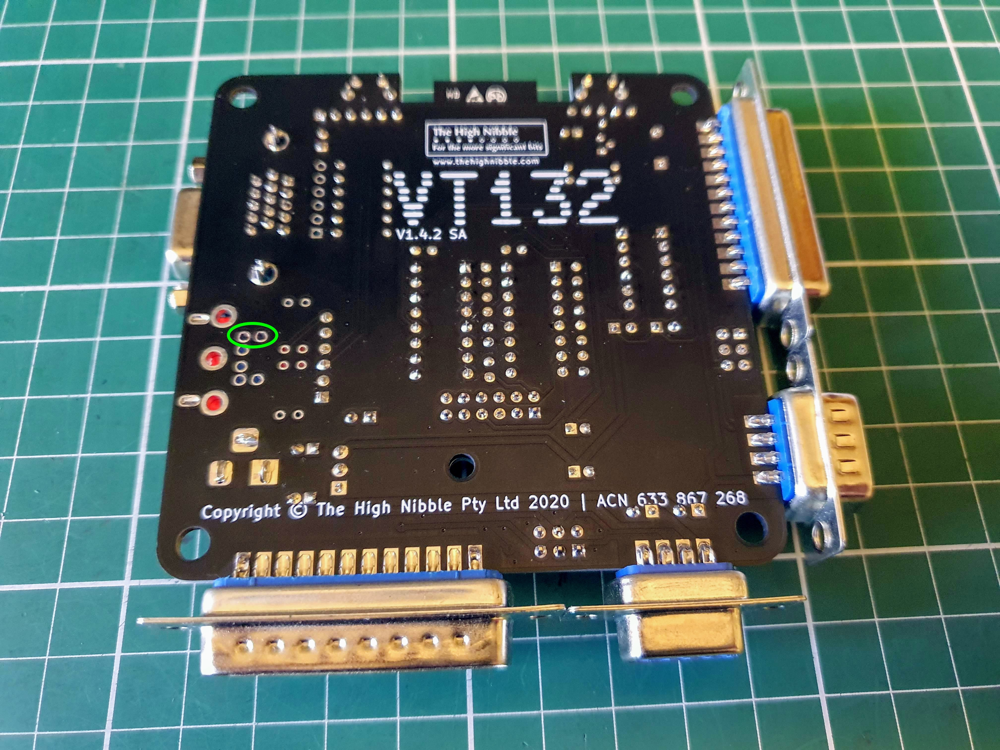

# USB Host Controller (UHC) Firmware Update Guide (Draft)

## Background

The VT132 USB-HID keyboard adapter, the small, red, PCB supplied when you order the USB-HID keyboard option, uses a CH559T microcontroller as a USB Host Controller (UHC).

The UHC runs its own firmware that translates between USB-HID protocols and a high-speed serial protocol for the ESP32 to work with a USB keyboard.

From time-to-time, firmware updates may be released to improve performance, fix bugs or extend the functionality of the UHC.

These firmware updates will be embedded in a release of the VT132 firmware and initiated from within the VT132 Setup screens.

## Update Procedure Overview

The procedure for updating the UHC firmware is:
1. Update the VT132 to the latest release, following the [OTA Firmware Update Guide](../ota/)
2. Navigate to the [SET-UP D](../vt100/operator/setup-d/) screen of the VT132
3. Press `9` on the keyboard to show the keyboard device status
4. Press `U` (uppercase 'U') to start the update process
5. Follow the on-screen prompts for restarting the VT132 to proceed with the update process

::: tip
If you have PS/2 keyboard connector you can still view the keyboard device status on the SET-UP D screen but pressing 'U' will do nothing.
:::

::: warning
While it is safe to perform the UHC firmware upgrade repeatedly, the CH559T microcontroller can only be re-flashed a limited number of times (appoximately 100) before it will fail to re-flash again and may not operate correctly after this time.

It is recommended to only update the UHC firmware when required, as indicated in the release notes for a VT132 firmware update.
:::

## Update Procedure Step-by-Step guide

### Update the VT132 to the latest release

This is documented in the [OTA Firmware Update Guide](../ota/)

### Navigate to the SET-UP D screen of the VT132

- Press the `SETUP` key ie. `<Alt><SysReq>` or `<Alt><PrintScreen>` to enter the VT132 SET-UP screens
- Press `5` three (3) times to navigate to the [SET-UP D](../vt100/operator/setup-d/) screen

### Show the keyboard device status

- Press `9` on the keyboard to show the keyboard device status
- Details of the current UHC firmware version and any attached keyboard will be shown like in this example:

### Start the UHC firmware update process

- Press `U` (uppercase 'U') on the keyboard to start the UHC firmware update process
- Details of the first UHC firmware update screen are shown here:

::: tip
As the first two (2) lines of text on this screen suggest, you can abort the update process by pressing `reset` during the first 5 seconds.

This is only the first point where you can abort the process, there are 2 other opportunities later in the process.
:::

### Proceeding with the update process

- As the text on the **UHC firmware upgrade** screen indicates, you must power-cycle the VT132 to proceed with the update process.
- In addition you must jumper/short two (2) pads on the back of the VT132 to force the UHC to restart in **programming mode**
- Diagrams showing the pads to short for both the **VT132 for RC2014** and the **VT132 Stand Alone** editions are given here:
  - In the first image the pads are circled in *GREEN*.
  - In the second image you can see how I normally do this with a pair of tweezers.

#### VT132 Designed for RC2104 edition

 

#### VT132 Stand Alone edition

 

### Finishing the update process

#### Failure

- If you have **not** successfully forced the UHC to restart in **programming mode**, you will see the following screen after the restart:
- This will also happen if you only **reset** the VT132 and have not performed a full power cycle
- If you see this screen, simply reset the VT132 and start the procedure again

#### Success

- If you have successfully forced the UHC to restart in **programming mode**, you will see the following screen after the restart:
- The UHC firmware update will now complete
- When you see the *GREEN* text `UHC upgrade complete.` the process is finsihed
- You must again perform a full power cycle to correctly restart the UHC following the firmware upgrade

