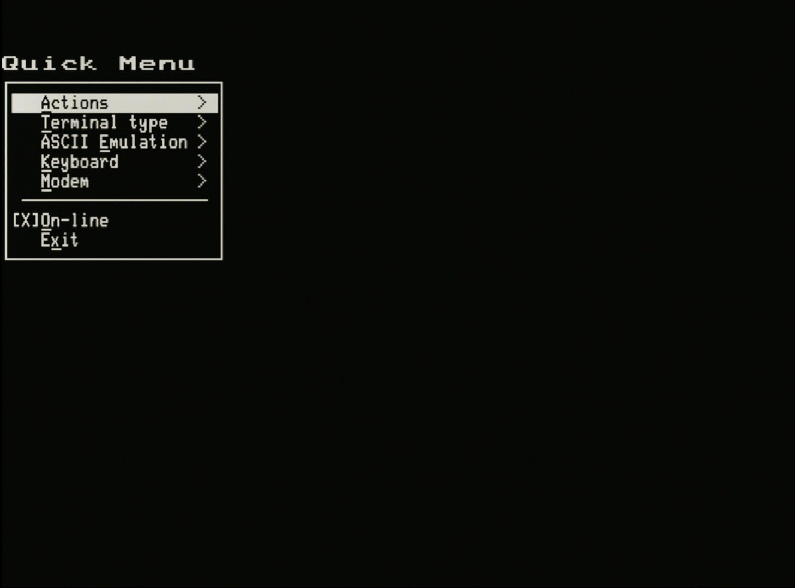
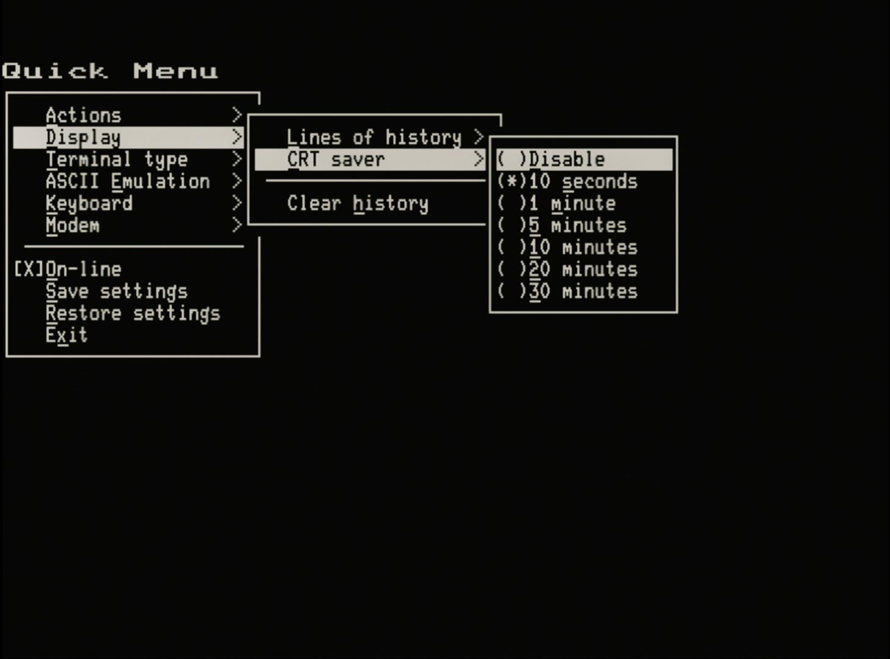
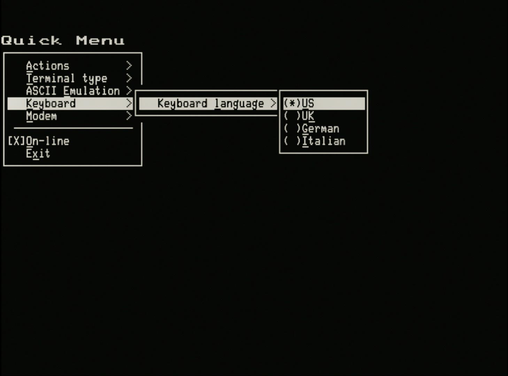

# Quick Menu Guide (Draft)

## Overview and rationale

The structure of the Setup screens based on the implementation in the original VT100 are difficult to extend. The VT132 already adds Setup-C & Setup-D to provided access and control for the majority of enhanced features. Additionally the VT100 style Setup screens makes finding, navigating to and changing/setting the desired feature cumbersome.

Digital Equipment Corporation (DEC) experimented with a number of different setup screen approaches throughout the life of the VT family of terminals, making significant changes to the implementation with the introduction of the VT220 and again with the VT510.

It was desirable to add a quick access menu for features that you might frequently want to change eg. terminal personality or to turn ANSI.SYS compliance on and off. Also it was desirable to have an easily extensible menu to access new features added to the VT132 over time, without having to add additional VT100 style Setup screens.

The solution was to add a VT510 style popup menu system. The implementation differs slightly to incorporate some more modern UI conventions and keyboard shot-cuts.

- not features can be accessed via the Quick Menu
- it is mainly for features that can't be accessed through Set-Up menus
- or features from Set-Up C & D that require quick access

## Accessing the Quick Menu

The **Quick Menu** is opened with the `<LeftAlt>-<Esc>` key combination. When these key are pressed together with *\<LeftAlt\>* being used like a *\<Shift\>* key, the display is cleared and the following **root** menu appears:

## Keyboard navigation in the Quick Menu

- Access the  Quick Menu by pressing `<LeftAlt><Esc>`
- Press `<Esc>` to close the Quick Menu
- Dim/faint features are currently disabled
- `<space>`, `<Enter/Return>` and `<right arrow>` make selections
- Pressing the underlined letter (any case) makes that selection (only in the current menu)
- `<Esc>`, `<Backspace>`, `<left arrow>` go back/exit. Of these, only `<Esc>` will close the Quick Menu
- Selecting an "action" i.e not a menu, checkbox or radio button, will execute the action and leave the quick menu.
- `<up arrow>` and `<down arrow>` navigate between choices in the current menu
  - these keys will wrap-around vertically from bottom-to-top, and top-to-bottom

## Indicators in the Quick Menu

- Binary selection of a feature is usually indicated with a Check Box
  - `[ ]` for unselected
  - `[X]` for selected
  - change this option with `<space>`, `<Enter/Return>` or `<right arrow>`
- Selection from a group of options is usually indicated with Radio Buttons
  - `( )` for not currently selected
  - `(*)` for the currently selected option
  - change the selection with `<space>`, `<Enter/Return>` or `<right arrow>`
- Menus are indicted with a `>` at the right-hand-side of the selection

## Actions menu

The available actions are:

- **Clear display** - equivalent to `ESC [ 2 J` followed by `ESC [ H` to clear the screen and *home* the cursor
- **Soft reset** - equivalent to `ESC [ !` resets the terminal to a default state but does not recall settings from NVR
- **Reset terminal** - equivalent to `ESC c` or pressing `0` in any of the **Setup** screens
- **Reboot** - equivalent to pressing the H/W Reset button in the VT132. Reboots the ESP32 resetting the terminal and the modem
- **Clear NVR** - completely erases all settings from the NVR for both the terminal and the modem

## New: Display menu

- **Lines of history** - selects the number of lines stored (or disable) the scroll history
- **CRT saver** - selects the timeout for (or disable) the screen saver
- **Clear history** - an action that clears the contents of the scroll history, same as `<Shift>-C` when in the scroll history

## Terminal type menu

- **Emulation mode** - selects between the eight (8) personalities also selectable from **Setup-D**
- **7-bit NRCS characters** - selects between MCS and NRCS modes, also selectable from **Setup-D**

## ASCII Emulation menu

- **White Screen** - a macro that sets *White* on *Black* as the default colours
- **Green Screen** - a macro that sets *Green* on *Black* as the default colours
- **Amber Screen** - a macro that sets *Brown* on *Black* as the default colours
- **Blue Screen** - a macro that sets *Cyan* on *Black* as the default colours
- **Ansi.sys** - a macro that sets

### DEC VT100 emulation modes

The first four (4) options *White/Green/Amber/Blue* set the terminal for

- VT100 mode with ANIS.SYS compliance **disabled**
- the **DEC VT100/VT220** Font
- resets to 80 column mode
- the **ANSI** Colour Palette (except *Amber* that sets the *VGA* Colour Palette for *Brown*)
- sets **Bold** to be both *Bright* and *Thick*

These are most useful for applications that expect to work with a VT100 terminal eg. WordStar or SuperCalc2

### ANSI.SYS emulation mode

The *Ansi.sys* option set the terminal for

- VT100 mode with ANIS.SYS compliance **enabled**
- the **PC Code Page 437** Font
- resets to 80 column mode
- the **VGA** Colour Palette
- sets **Bold** to be only *Bright*

This is most useful when visiting Bulletin Board Systems (BBS) that expect to work with an ANSI.SYS compliant terminal emulator

## Keyboard menu

- **Keyboard language** - selects between the four (4) keyboard languages also selectable from **Setup-D**

## Modem menu

- **Enable modem locally** - selects between the two (2) operating modes for the modem
  - `[ ]` - unselected (default), the modem is accessible only via its own UART on the RC2014 Bus pins *TxB/RxB* or via the 6 pin *Modem Part B* header
  - `[X]` - selected, the modem is disconnected from the UART and is available to the VT100 terminal *"locally"* when the terminal is in `LOCAL` mode (see: [On-Line (root menu)](#on-line-root-menu))

## On-line (root menu)

- **On-line** - equivalent to pressing `4` in any of the **Setup** screens to select between `ONLINE` or `LOCAL`
  - `[X]` - selected `ONLINE` (default), the terminal is connected to the UART on the RC2014 Bus pins *TxA/RxA*
  - `[ ]` - unselected `LOCAL`, the terminal is disconnected from the UART and will
    - echo "locally" if it is not connected to the modem
    - connect directly to the modem if set (see: [Modem menu](#modem-menu))

## Save settings (root menu)

- Save all settings to NVR for the terminal
- equivalent to pressing `<Shift>-S` in any of the **Setup** screens

## Restore settings (root menu)

- Restore all settings from NVR for the terminal
- equivalent to pressing `<Shift>-R` in any of the **Setup** screens

## Exit (root menu)

- **Exit** - closes the **Quick Menu**, the same as pressing `<Esc>` when in the root menu.
