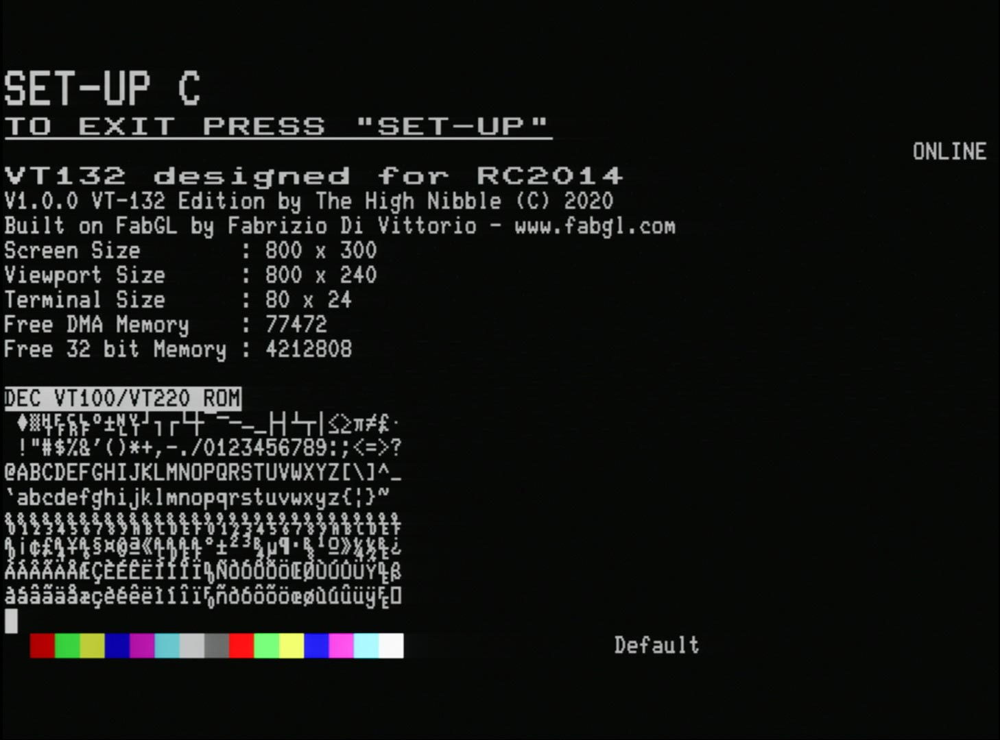
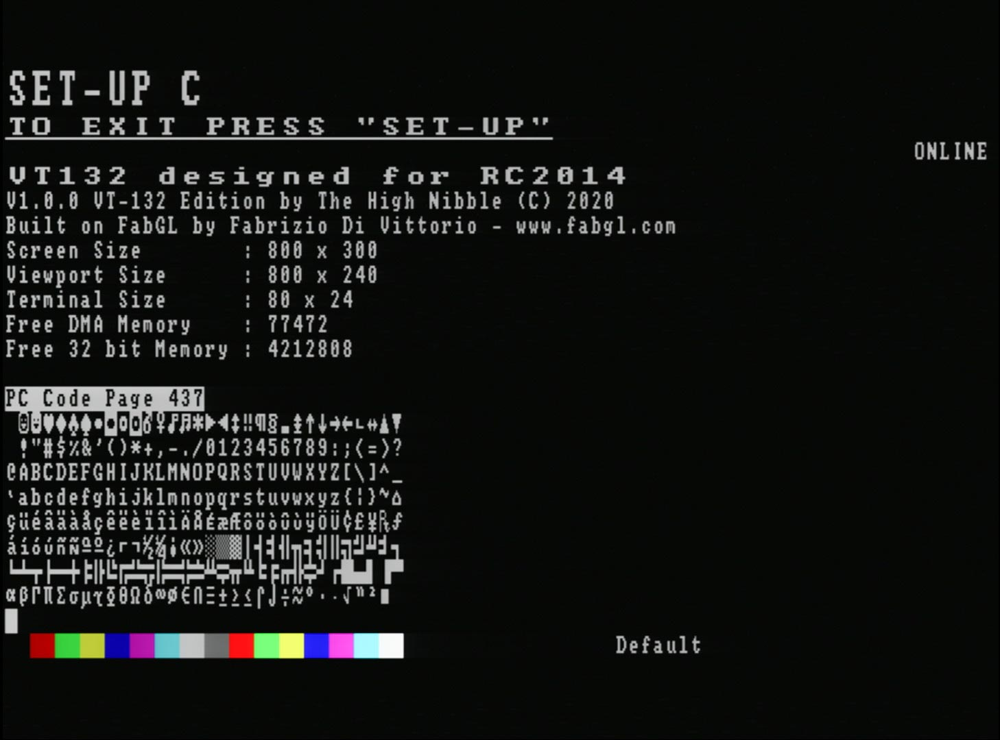
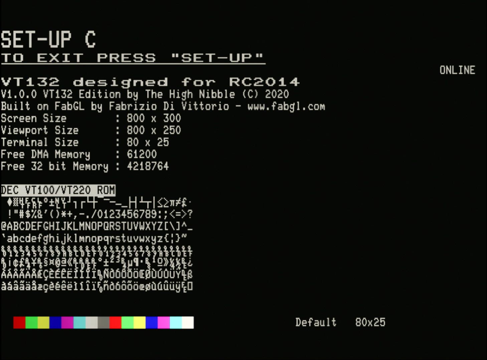
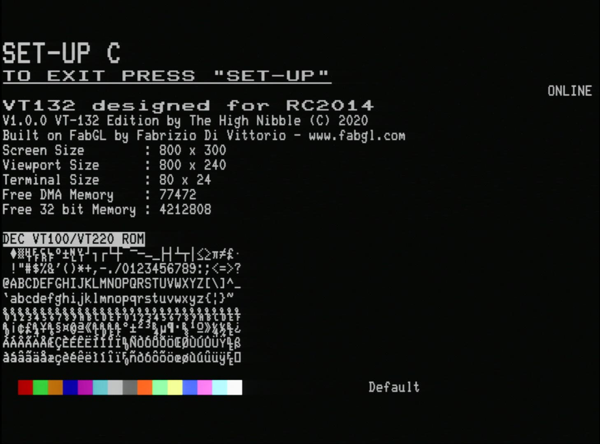

# SET-UP C - Code Pages, ANSI colours, System Information *(enhancement)*

## Background

The `SET-UP C` screen is an enhancement that the VT132 adds to the original VT100 functionality.

The VT132 implements 16 colour support and multiple font/codepage support and these features are accessible and configurable through the`SET-UP C` screen.

In addition to the enhanced features configurable through this screen, it also displays some useful information about the VT132 including:

- firmware version details
- credit to the FabGL library on which it is built
- screen resolutions
- memory utilization

## Help

The integrated help screen is accessible by pressing the `F1` key as with the other SET-UP screens, provides a summary of the features that are configurable on this screen.

## Codepage Support

Pressing `2` on the keyboard toggles between the two available codepages.

The main purpose of providing [CP437](#pc-code-page-437) support is to allow visiting BBS systems that render menus and ASCII art expecting an ANSI terminal with VGA font support. You may find other uses but for general use this font is not as clear as the [DEC fonts](#dec-vt100-vt220-rom-code-page).

### DEC VT100/VT220 ROM Code Page

The default Codepage/Font shown in the previous screen images is derived from original DEC VT100 and VT220 ROMs.

- Characters from 0x00 to 0x7F are from the VT100 character ROM and include the standard [7-bit ASCII](https://en.wikipedia.org/wiki/ASCII#Character_set) character set and the [DEC Special Graphics](https://en.wikipedia.org/wiki/DEC_Special_Graphics) character set.
- Characters from 0x80 to 0xFF are from the VT220 character ROM and implement the upper half (non-ASCII) of the [DEC Multinational Character Set (MCS)](https://en.wikipedia.org/wiki/Multinational_Character_Set)

::: tip

This codepage is also available in 132 column mode.
:::

### PC Code Page 437

The alternate Codepage/Font [CP437](https://en.wikipedia.org/wiki/Code_page_437), also known as the VGA/ANSI character set from the MS-DOS era, is shown here.

::: tip

When CP437 is selected as the current font, rendering characters from the **DEC Special Graphics** character set will still work as they are automatically mapped to corresponding characters in the CP437 font.
:::

::: warning

This codepage **is not available** in 132 column mode.
:::

## 24/25 Line Support

Pressing `3` on the keyboard toggles between 24 and 25 line support. There is a noticeable delay while the VGA signal re-syncs with the changed viewport resolution.

The original VT100 supported 24 lines of text. With the introduction of the IBM PC a 25 line display became the norm.

The main purpose of providing 25 line support is to allow visiting BBS systems that render menus and ASCII art expecting an ANSI terminal with 25 line support.

When 25 line support is selected, the details on the `SET-UP C` screen change as follows:

::: tip

25 line support is also available in 132 column mode.
:::

## ANSI/VGA Palette Support

Pressing `6` on the keyboard toggles between standard ANSI and VGA colour palettes. The colour changes are only subtle and effect only a few colours.

With the introduction of colour the ANSI escape codes for [SGR (Select Graphic Rendition)](https://en.wikipedia.org/wiki/ANSI_escape_code#SGR_parameters) were extended to cater for colour.

The VT132 implements 4 bit colour providing for 16 possible colours.

The standard ANSI colours are represented under the heading "Windows Console" in this [4 bit ANSI colour table](https://en.wikipedia.org/wiki/ANSI_escape_code#3/4_bit). The VGA text colours were slightly different and are shown under the heading "VGA' in the same table.

The main purpose of providing VGA colour palette support is to allow visiting BBS systems that render menus and ASCII art to be viewed with better colour accuracy. The most noticeable change is that the ANSI palette **dark yellow** becomes **brown** in the VGA palette. 

When the VGA colour palette is selected, the `SET-UP C` screen change as follows:

## Setting Default Foreground and Background Colours

Pressing `7` on the keyboard sets the default foreground colour based on the current cursor position.

Pressing `8` on the keyboard sets the default background colour based on the current cursor position.

Moving the cursor left or right with the `<left>` and `<right>` cursor control keys, `<tab>` or `<cr>` enables you to choose the colour you want to apply.

The current default foreground and background colour combination is displayed by the word `Default` on the last line of the screen.

The ANSI escape codes for [SGR (Select Graphic Rendition)](https://en.wikipedia.org/wiki/ANSI_escape_code#SGR_parameters) allow a default foreground and background colour to be specified, in addition to selecting specific colours on demand. When no specific colour attributes are in effect the default foreground and background colours are used.

This feature of the VT132 lets you manually select your preferred default foreground and background colours.

This way you can make the VT132 appear as a green, amber , white (default) or blue phosphor terminal, or any other colour combination that you prefer.

## SET-UP C - advance to next setup screen

On the `SET-UP C` screen, pressing `5` will advance to the [`SET-UP D`](../setup-d/) screen, before returning to the `SET-UP A` screen.
