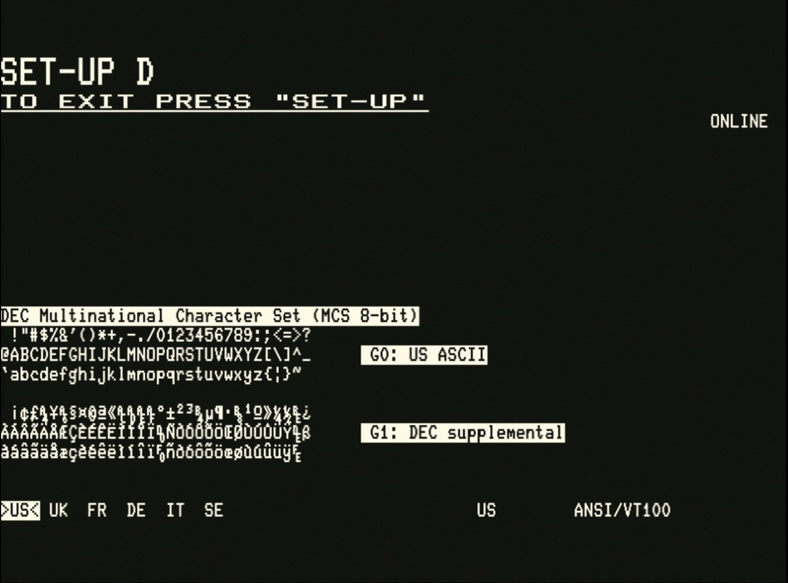
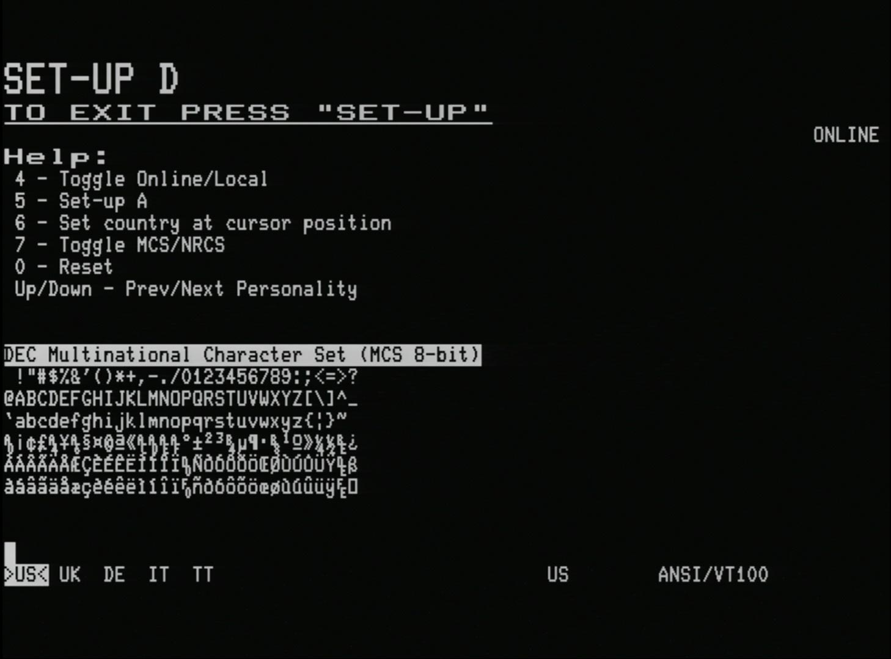

# SET-UP D - Multinational Character Set, NRCS, International Keyboards, Personalities  *(enhancement)*

## Background

The `SET-UP D` screen is an enhancement that the VT132 adds to the original VT100 functionality.

The VT132 implements multinational character support (derived from the VT220), international keyboard support and personality support for a range of other terminals of the era (available from the FabGL library), these features are accessible and configurable through the`SET-UP D` screen.

## Help

The integrated help screen is accessible by pressing the `F1` key as with the other SET-UP screens, provides a summary of the features that are configurable on this screen.

## DEC Multinational Character Set (MCS 8-bit) Support

The [DEC Multinational Character Set (MCS)](https://en.wikipedia.org/wiki/Multinational_Character_Set) is the default character set on the VT132. It provides:

- a standard 7-bit ASCII character set
- an extended 8-bit ASCII character set including accented characters, currency symbols, and other character glyphs missing from 7-bit ASCII
- (and is the ancestor of the ISO 8859-1 'Latin 1' codepage)
- a full MCS 8-bit character set available to all applications that are 8-bit clean

## DEC National Replacement Character Set (NRCS 7-bit) Support

The [DEC National Replacement Character Set (NRCS)](https://en.wikipedia.org/wiki/National_Replacement_Character_Set) is an alternate character set on the VT132. It is mutually exclusive with the MCS. It provides:

- a standard 7-bit US-ASCII character set, with
- a maximum of 12 standard US-ASCII characters substituted with language/country specific characters for a nominated country
- (currently implemented for UK (British), FR (French), DE (German), IT (Italian) and SE (Swedish) on the VT132, with more countries to follow)
- international character support for applications that are not 8-bit clean and that only support 7-bit ASCII

The UK is the simplest of these with only the pound symbol `£` substituted for the US-ASCII `#` symbol at ASCII 35 (dec) or 0x24 (hex).

For other countries/languages, see the reference above to see which characters are substituted.

::: warning
Only one country can be active for NRCS at a time. Changing the country will appear to change the contents of files created while working with another country, because the same 7-bit ASCII code is used to represent different characters depending on the country currently selected.
:::

## International Keyboard Support

PC keyboard scancode to character set mappings are provided for the same country/languages that the VT132 currently support with NRCS (see next section).

Includes dead-key support (country specific) for composed characters with accent diacritics ` ´ ^ ¨ ~ (MCS 8-bit character set and CP437)

- à á â ä ā À Á Â Ä Ã
- è é ê ë È É Ê Ë
- ì í î ï Ì Í Î Ï
- ò ó ô ö õ Ò Ó Ô Ö Õ
- ù ú û ü Ù Ú Û Ü
- ñ Ñ
- ÿ Ÿ

note: not all keyboard layouts support all dead-keys

pressing a dead-key twice, or followed by `<space>`, will output the accent character if printable
` ^ ~ are printable as standalone characters
´ ¨ are not printable as standalone characters
see: [https://en.wikipedia.org/wiki/Dead_key]() for further information on the use of dead-keys

## Selecting character set and keyboard support

Pressing `7` on the keyboard toggles between the two available character set modes

- DEC Multinational Character Set (MCS 8-bit), and
- DEC National Replacement Character Set (NRCS 7-bit)

Pressing `6` on the keyboard selects the country/language for both NRCS mode and keyboard support, based on the current cursor position. Current choices are:

- US
- UK
- FR (French)
- DE (German)
- IT (Italian)
- SE (Swedish)

Moving the cursor left or right with the `<left>` and `<right>` cursor control keys, `<tab>` or `<cr>` enables you to choose the language/country you want to select.

The current country/keyboard as a word eg. `German` on the last line of the screen.

::: warning

NRCS country/language selection and keyboard country/language selection are not independent.
On the VT220 the country/language selection was made automatically by the keyboard that was attached to the terminal.
At least with the VT132 you get to choose.
:::

## Personality Support

The FabGL library with which the VT132 is built provides a number of 'Personalities' for different terminals of the era.

It maps the escape sequences that control these terminals to the equivalent escape sequences for the VT100.

The special, non-ASCII keyboard keys (mainly cursor control keys) are mapped to the typical "WordStar" key mappings. Details tba.

The available personalities are:

- ANSI/VT100 (the default VT100 operating mode)
- WordStar/VT100 (same as above but with WordStar cursor navigation key mappings)
- ADM-3A
- ADM-31
- Hazeltine 1500
- Osborne 1
- Kaypro
- VT52 (already a feature of the VT100, this personality simply actives VT52 compatibility mode)

## Selecting personality support

Pressing the `<up>` and `<down>` cursor control keys cycles to the `Previous` or `Next` personality in the list.

## SET-UP D - advance to next setup screen

On the `SET-UP D` screen, pressing `5` will return to the [`SET-UP A`](../#part-2-set-up-mode) screen.
